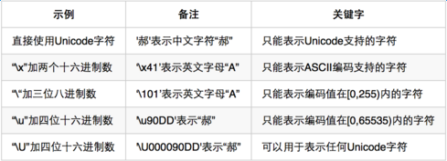
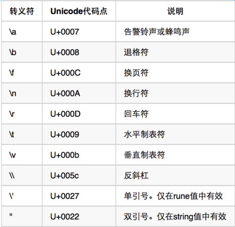

### For-learning-Go-Tutorial

Go语言是谷歌2009发布的第二款开源编程语言

Go语言专门针对多处理器系统应用程序的编程进行了优化，使用Go编译的程序可以媲美C或C++代码的速度，而且更加安全、支持并行进程。

因而一直想的是自己可以根据自己学习和使用Go语言编程的心得，写一本Go的书可以帮助想要学习Go语言的初学者快速入门开发和使用！

#### 基本数据类型

Go基本数据类型这块是基础所以需要着重去学习和实践运用。

基本数据类型有：
* [整型](#整型)
* [浮点型](#浮点型)
* [复数](#复数)
* [布尔型](#布尔型)
* [字符串](#字符串)
* [常量](#常量)

#### 整型
Go语言同时提供了有符号和无符号类型的整数运算。

```go
有符号整形数类型:
int8,长度:1字节, 取值范围:(-128 ~ 127)
int16,长度:2字节,取值范围:(-32768 ~ 32767）
int32,长度:4字节,取值范围:(-2,147,483,648 ~ 2,147,483,647）
int64.长度:8字节,取值范围:(-9,223,372,036,854,775,808 ~ 9,223,372,036,854,775,807)

无符号整形数类型:
uint8,长度:1字节, 取值范围:(0 ~ 255)
uint16,长度:2字节,取值范围:(0 ~ 65535)
uint32,长度:4字节,取值范围:(0 ~ 4,294,967,295)
uint64.长度:8字节,取值范围:(0 ~ 18,446,744,073,709,551,615)
```
rune类型是 Unicode 字符类型，和 int32 类型等价，通常用于表示一个 Unicode 码点。rune 和 int32 可以互换使用。
一个Unicode代码点通常由"U+"和一个以十六进制表示法表示的整数表示，例如英文字母'A'的Unicode代码点为"U+0041"。

此外rune类型的值需要由单引号"'"包裹，不过我们还可以用另外几种方式表示: 
<p align="center">

</p>

rune类型值的表示中支持几种特殊的字符序列，即:转义符。

<p align="center">

</p>

byte是uint8类型的等价类型，byte类型一般用于强调数值是一个原始的数据而不是 一个小的整数。

uintptr 是一种无符号的整数类型，没有指定具体的bit大小但是足以容纳指针。 uintptr类型只有在底层编程是才需要，特别是Go语言和C语言函数库或操作系统接口相交互的地方。

此外在这里还需要了解下进制的转换方便以后学习和使用:
```markdown
十进制整数: 使用0-9的数字表示且不以0开头。// 100 123455
八进制整数: 以0开头，0-7的数字表示。 // 0100 0600
十六进制整数: 以0X或者是0x开头，0-9|A-F|a-f组成 //0xff 0xFF12
```

#### 浮点型

浮点型。float32 精确到小数点后 7 位，float64 精确到小数点后 15 位。由于精确度的缘故，你在使用 == 或者 != 来比较浮点数时应当非常小心。
```go
浮点型（IEEE-754 标准）:
float32:（+- 1e-45 -> +- 3.4 * 1e38）32位浮点类型

float64:（+- 5 1e-324 -> 107 1e308）64位浮点类型
```
浮点型中指数部分由"E"或"e"以及带正负号的10进制整数表示。例:3.9E-2表示浮点数0.039。3.9E+1表示浮点数39。
有时候浮点数类型值也可以被简化。比如39.0可以被简化为39。0.039可以被简化为.039。在Golang中浮点数的相关部分只能由10进制表示法表示。


#### 复数
```go
复数类型:
complex64: 由两个float32类型的值分别表示复数的实数部分和虚数部分

complex128: 由两个float64类型的值表示复数的实数部分和虚数部分
```
复数类型的值一般由浮点数表示的实数部分、加号"+"、浮点数表示的虚数部分以及小写字母"i"组成，例如：
```go
 var x complex128 = complex(1,2)  //1+2i
```

#### 布尔型
在Golang中，布尔值的类型为 bool，值是 true 或 false,布尔可以做3种逻辑运算，&&（逻辑且），||（逻辑或），！（逻辑非）,布尔类型的值不支持其他类型的转换.


在整型运算中，算术运算、逻辑运算和比较运算，运算符优先级从上到下递减顺序排列:
```go
 *      /     %     <<     >>     &     &^ 
 +      -     |     ^      
 ==     !=    <     <=     >      >=
 &&
 ||

```
在同一个优先级，使用左优先结合规则，但是使用括号可以明确优先顺序。

bit位操作运算符：

|符号 | 操作             |操作数是否区分符号 |
|-----|-----------------|------------------|
|  &	 | 位运算 AND       |No               | 
|  ^	 | 位运算 XOR       |No               | 
|  &^	| 位清空 (AND NOT) |No               | 
|  <<	| 左移             |Yes              | 
|  >> | 右移             |Yes              | 
