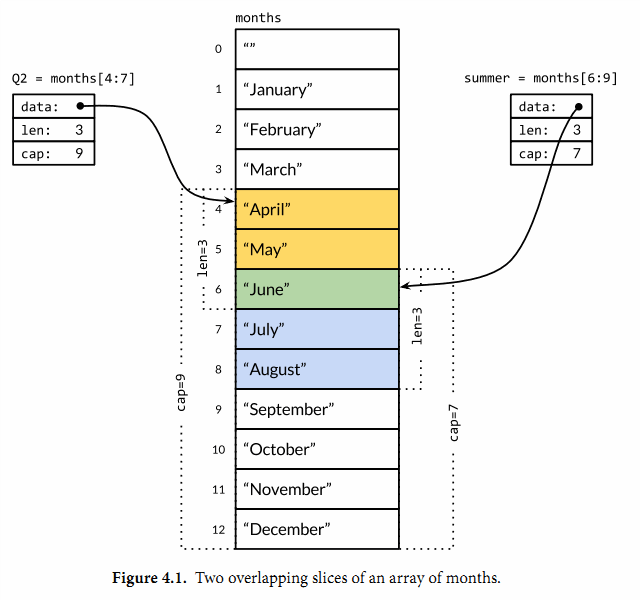
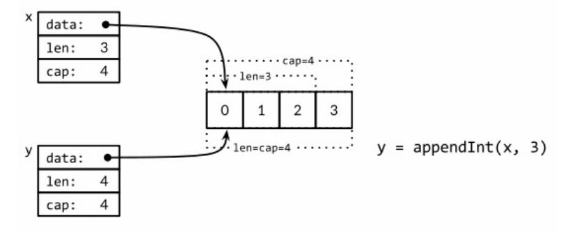
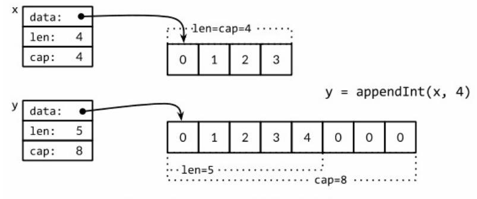

### For-learning-Go-Tutorial

Go语言是谷歌2009发布的第二款开源编程语言

Go语言专门针对多处理器系统应用程序的编程进行了优化，使用Go编译的程序可以媲美C或C++代码的速度，而且更加安全、支持并行进程。

因而一直想的是自己可以根据自己学习和使用Go语言编程的心得，写一本Go的书可以帮助想要学习Go语言的初学者快速入门开发和使用！

#### 复合数据类型

复合数据类型主要包括:

* [数组](#数组)
* [Slice](#Slice)
* [Map](#Map)
* [结构体](#结构体)
* [JSON](#JSON)

#### 数组

在复合数据类型中数组是由同构的元素组成——每个数组元素都是完全相同的类型——结构体则是由异构的元素组成的。数组和结构体都是有固定内存大小的数据结构。相比之下，slice和map则是动态的数据结构，它们将根据需要动态增长。

数组是一个由固定长度的特定类型元素组成的序列，一个数组可以由零个或多个元素组成。由于数组的长度是固定的，因而在使用的时候我们用的最多的是slice（切片），它是可以增长和收缩动态序列，slice功能也更灵活，但是要理解slice工作原理的话需要先理解数组。

数组的每个元素可以通过索引下标来访问，索引下标的范围是从0开始到数组长度减1的位置。内置的len函数将返回数组中元素的个数。

数组的每个元素都被初始化为元素类型对应的零值，对于数字类型来说就是0。

```go
var m [3]int = [3]int{1, 2, 3}
var n [3]int = [3]int{1, 2}
fmt.Println(n[2]) // "0"
```
在数组字面值中，如果在数组的长度位置出现的是“...”省略号，则表示数组的长度是根据初始化值的个数来计算。

```
m := [...]int{1, 2, 3}
fmt.Printf("%T\n", m) // "[3]int"
```
数组的长度是数组类型的一个组成部分，因此[3]int和[4]int是两种不同的数组类型。数组的长度必须是常量表达式，因为数组的长度需要在编译阶段确定。

数组可以直接进行比较，当数组内的元素都一样的时候表示两个数组相等。

```go
arr1 := [3]int{1, 2, 3}
arr2 := [3]int{1, 2, 3}
arr3 := [3]int{1, 2, 4} 
fmt.Println(arr1 == arr2, arr1 == arr3)  //true,false
```
数组可以作为函数的参数传入，但由于数组在作为参数的时候，其实是进行了拷贝，这样在函数内部改变数组的值，是不影响到外面的数组的值得。

```go
func ArrIsArgs(arr [4]int) {
    arr[0] = 120
}
m := [...]int{1, 2, 3, 4}
ArrIsArgs(m)
```
如果想要改变就只能使用指针，在函数内部改变的数组的值，也会改变外面的数组的值：

```
func ArrIsArgs(arr *[4]int) {
   arr[0] = 20
}
m:= [...]int{1, 2, 3, 4}
ArrIsArgs(&m)
```

通常这样的情况下都是用切片来解决，而不是用数组。

这里的`*` 和`&`的区别:

* `&` 是取地址符号 , 即取得某个变量的地址 ,如: &a
* `*` 是指针运算符 , 可以表示一个变量是指针类型 , 也可以表示一个指针变量所指向的存储单元 , 也就是这个地址所存储的值.

#### Slice

Slice(切片)代表变长的序列,序列中每个元素都有相同的类型。一个slice类型一般写作[]T,其中T代表slice中元素的类型;slice的语法和数组很像,只是没有固定长度而已。

数组和slice关系非常密切，一个slice可以访问数组的部分或者全部数据，而且slice的底层本身就是对数组的引用。

一个Slice由三部分组成：指针，长度和容量。内置的len和cap函数可以分别返回slice的长度和容量。指针指向第一个slice元素对应的底层数组元素的地址,要注意的是slice的第一个元素并不一定就是数组的第一个元素。长度对应slice中元素的数目;长度不能超过容量,容量一般是从slice的开始位置到底层数据的结尾位置。内置的len和cap函数分别返回slice的长度和容量。

多个slice之间可以共享底层的数据,并且引用的数组部分区间可能重叠。图4.1显示了表示一年中每个月份名字的字符串数组,还有重叠引用了该数组的两个slice。数组这样定义.

```go
months := [...]string{1: "January", /* ... */, 12: "December"}
```

一月份是months[1],十二月份是months[12]。通常,数组的第一个元素从索引0开始,但是月份一般是从1开始的,因此我们声明数组时直接跳过第0个元素,第0个元素会被自动初始化为空字符串。

<p align="center">

</p>

slice的切片操作s[i:j],其中0 ≤ i≤ j≤ cap(s),用于创建一个新的slice,引用s的从第i个元素开始到第j-1个元素的子序列。新的slice将只有j-i个元素。如果i位置的索引被省略的话将使用0代替,如果j位置的索引被省略的话将使用len(s)代替。

如果切片操作超出cap(s)的上限将导致一个panic异常,但是超出len(s)则是意味着扩展了lice,因为新slice的长度会变大.

* 注意: 这里截取slice的时候容易犯错误

```go

func main(){
   p:=[]int{1,2,3}
   fmt.Println("p:",p)

   m1 :=p[:2]
   fmt.Println("m1:",m1)

   m2 := m1[1:]
   fmt.Println("m2:",m2)

   m3 := m2[:2]
   m4 := p[:2][1:][:2]
   fmt.Println("m3",m3)
   fmt.Println("m4",m4)
}

结果如下:

p: [1 2 3]
m1: [1 2]
m2: [2]
m3 [2 3]
m4 [2 3]
```

这里大家可能会有疑问m4中p[:2][1:]已经等价与m2中的截取到的值[２]了为何还可以在接续截取m2[:2]==m4　操作，其实这里就要说到切片的原因，slice的底层本身就是对数组的引用，因而多个 slice 共享的是底层的同一个数组。

虽然 m４ 表面上没有，但是如果你指定了截止的位置并且这个位置没有超过底层数组的范围，它就会指针引用底层的数组，这还是可以取到底层数组的值。

slice创建方式主要有两种：

1. 基于数组创建。

2. 直接创建。

* 基于数组创建：
```go
arrVar := [4]int{1, 2, 3，4}
sliceVar := arrVar[1:3]
```
数组arrVar和sliceVar里面的地址其实是一样的，因而如果你改变sliceVar里面的变量，那么arrVar里面的变量也会随之改变。

* 直接创建

1. 内建函数new分配了零值填充的元素类型的内存空间，并且返回其地址，一个指针类型的值。

```go
var p *[]int = new([]int)  //分配slice结构内存
var ｍ []int = make([]int,100) //m指向一个新分配的有100个整数的数组
```

因此:

```go
new 分配；make 初始化
new(T) 返回 *T 指向一个零值 T
make(T) 返回初始化后的 T
```

注意: make仅适用于 map，slice 和 channel，并且返回的不是指针。应当用 new 获得特定的指针。

2. 内置的make函数创建一个指定元素类型、长度和容量的slice。容量部分可以省略,在这种情况下,容量将等于长度。

使用内置的make()函数来创建。事实上还是会创建一个匿名的数组，只是不需要我们来定义。

```go
make([]T, len)
make([]T, len, cap) // same as make([]T, cap)[:len]
```
在底层,make创建了一个匿名的数组变量,然后返回一个slice;只有通过返回的slice才能引用底层匿名的数组变量。在第一种语句中,slice是整个数组的view。在第二个语句中,slice只引用了底层数组的前len个元素,但是容量将包含整个的数组。额外的元素是留给未来的增长用的。

```go
slice1 := make([]int,5)//创建一个元素个数5的slice,cap也是5
slice2 := make([]int,5,10)//创建一个元素个数5的slice，cap是10
slice3 := []int{1,2,3,4,5}//创建一个元素个数为5的slice，cap是5
var slice []int //创建一个空的slice，cap和len都是0
```

和数组不同的是, slice之间不能比较,因此我们不能使用==操作符来判断两个slice是否含有全部相等元素。不过标准库提供了高度优化的bytes.Equal函数来判断两个字节型slice是否相等([]byte),但是对于其他类型的slice,我们必须自己展开每个元素进行比较:

```go
func equal(x, y []string) bool {
   if len(x) != len(y) {
        return false
   }
   for i := range x {
        if x[i] != y[i] {
            return false
        }
  }
  return true
}
```

通过在slice的深度相等测试,运行的时间并不比支持==操作的数组或字符串更多,但是为何slice不直接支持比较运算符呢?这方面有两个原因。第一个原因,一个slice的元素是间接引用的,一个slice甚至可以包含自身。虽然有很多办法处理这种情形,但是没有一个是简单有效的。

第二个原因,因为slice的元素是间接引用的,一个固定值的slice在不同的时间可能包含不同的元素,因为底层数组的元素可能会被修改。并且Go语言中map等哈希表之类的数据结构的key只做简单的浅拷贝,它要求在整个声明周期中相等的key必须对相同的元素。对于像指针或chan之类的引用类型,==相等测试可以判断两个是否是引用相同的对象。一个针对slice的浅相等测试的==操作符可能是有一定用处的,也能临时解决map类型的key问题,但是slice和数组不同的相等测试行为会让人困惑。因此,安全的做法是直接禁止slice之间的比较操作。

slice唯一合法的比较操作是和nil比较,例如:

```go
if slice == nil { /* ... */ }
```
一个零值的slice等于nil。一个nil值的slice并没有底层数组。一个nil值的slice的长度和容量都是0,但是也有非nil值的slice的长度和容量也是0的,例如[]int{}或make([]int, 3)[3:]。与任意类型的nil值一样,我们可以用[]int(nil)类型转换表达式来生成一个对应类型slice的nil值。

```go
var s []int      // len(s) == 0, s == nil
s = nil         // len(s) == 0, s == nil
s = []int(nil)  // len(s) == 0, s == nil
s = []int{}     // len(s) == 0, s != nil
```

如果你需要测试一个slice是否是空的,使用len(s) == 0来判断,而不应该用s == nil来判断。除了和nil相等比较外,一个nil值的slice的行为和其它任意0长度的slice一样.

此外Slice切片还有append函数用于向slice追加元素.虽然Slice是可以动态扩展的。但Slice的动态扩展是有代价的，也就是说如果在确定大小的前提下，最好是设置好slice的cap大小.

```go
func main() {
    var x, y []int
    for i := 0; i < 10; i++ {
        y = appendInt(x, i)
        fmt.Printf("%d cap=%d\t%v\n", i, cap(y), y)
        x = y
    }
}
```
每一次容量的变化都会导致重新分配内存和copy操作:
```go
0 cap=1 [0]
1 cap=2 [0 1]
2 cap=4 [0 1 2]
3 cap=4 [0 1 2 3]
4 cap=8 [0 1 2 3 4]
5 cap=8 [0 1 2 3 4 5]
6 cap=8 [0 1 2 3 4 5 6]
7 cap=8 [0 1 2 3 4 5 6 7]
8 cap=16 [0 1 2 3 4 5 6 7 8]
9 cap=16 [0 1 2 3 4 5 6 7 8 9]
```
我们仔细查看i=3次的迭代。当时x包含了[0 1 2]三个元素,但是容量是4,因此可以简单将新的元素添加到末尾,不需要新的内存分配。然后新的y的长度和容量都是4,并且和x引用着相同的底层数组.

<p align="center">

</p>

在下一次迭代时i=4,现在没有新的空余的空间了,因此appendInt函数分配一个容量为8的底层数组,将x的4个元素[0 1 2 3]复制到新空间的开头,然后添加新的元素i,新元素的值是4。新的y的长度是5,容量是8;后面有3个空闲的位置,三次迭代都不需要分配新的空间。当前迭代中,y和x是对应不同底层数组的view。

<p align="center">

</p>

当slice的的容量等于len的时候，cap是翻倍了。append的底层原理就是当slice的容量满了的时候，重新建立一块内存，然后将原来的数据拷贝到新建的内存。所以说容量的扩充是存在内存的建立和复制的。该过程将会影响到系统的运行速度。

这里需要注意下新的1.16的Go版本slice扩容发生了变化：

Go1.16 以前的 slice 的扩容条件是 len，在最新的代码中，已经改为了以 cap 属性作为基准。

```go
  // src/runtime/slice.go
 if cap > doublecap {
  newcap = cap
 } else {
  // 这是以前的代码：if old.len < 1024 {
  // 下面是 Go1.16rc1 的代码
  if old.cap < 1024 {
   newcap = doublecap
  }
```
以官方的 test case 为例：
```go
func main() {
 const N = 1024
 var a [N]int
 x := cap(append(a[:N-1:N], 9, 9))
 y := cap(append(a[:N:N], 9))
 println(cap(x), cap(y))
}
```
在 Go1.16 以前输出 2048, 1280。在 Go1.16 及以后输出 1280, 1280，保证了两种的一致。


更新slice变量不仅对调用append函数是必要的,实际上对应任何可能导致长度、容量或底层数组变化的操作都是必要的。要正确地使用slice,需要记住尽管底层数组的元素是间接访问的,但是slice对应结构体本身的指针、长度和容量部分是直接访问的。要更新这些信息需要像上面例子那样一个显式的赋值操作。从这个角度看,slice并不是一个纯粹的引用类型,它实际上是一个类似下面结构体的聚合类型:

```go
type IntSlice struct {
    ptr         *int
    len, cap    int
}
```

我们的appendInt函数每次只能向slice追加一个元素,但是内置的append函数则可以追加多个元素,甚至追加一个slice。

```go
var x []int
x = append(x, 1)
x = append(x, 2, 3)
x = append(x, 4, 5, 6)
x = append(x, x...) // append the slice x
fmt.Println(x)     // "[1 2 3 4 5 6 1 2 3 4 5 6]"
```

通过这样的修改我们可以可以达到append函数类似的功能。其中在appendInt函数参数中的最后的“...”省略号表示接收变长的参数为slice。

内置的copy函数可以方便地将一个slice复制另一个相同类型的slice。使用copy函数：。
```go
slice1 := []int{1, 2, 3, 4, 5}
slice2 := []int{5, 4, 3}
copy(slice2, slice1) // 只会复制slice1的前3个元素到slice2中
copy(slice1, slice2) // 只会复制slice2的3个元素到slice1的前3个位置
```
copy函数的第一个参数是要复制的目标slice,第二个参数是源slice,目标和源的位置顺序和dst = src赋值语句是一致的。两个slice可以共享同一个底层数组,甚至有重叠也没有问题。copy函数将返回成功复制的元素的个数(我们这里没有用到),等于两个slice中较小的长度,所以我们不用担心覆盖会超出目标slice的范围。

#### Slice使用技巧

 Slice的使用方式有很多例如旋转slice、反转slice或在slice原有内存空间修改元素。
给定一个字符串列表,下面的nonempty函数将在原有slice内存空间之上返回不包含空字符串的列表:

```go
// Nonempty is an example of an in-place slice algorithm.
package main
import "fmt"
// nonempty returns a slice holding only the non-empty strings.
// The underlying array is modified during the call.
func nonempty(strings []string) []string {
    i := 0
    for _, s := range strings {
         if s != "" {
            strings[i] = s
         i++
        }
    }
    return strings[:i]
}

```

比较微妙的地方是,输入的slice和输出的slice共享一个底层数组。这可以避免分配另一个数
组,不过原来的数据将可能会被覆盖,正如下面两个打印语句看到的那样:
```go
data := []string{"1", "", "3"}
fmt.Printf("%q\n", nonempty(data)) // `["1" "3"]`
fmt.Printf("%q\n", data)
// `["1" "3" "3"]`
```
因此我们通常会这样使用nonempty函数:data = nonempty(data)。 
nonempty函数也可以使用append函数实现:
```go
func nonempty2(strings []string) []string {
out := strings[:0] // zero-length slice of original
    for _, s := range strings {
        if s != "" {
            out = append(out, s)
        }
    }
    return out
}
```
无论如何实现,以这种方式重用一个slice一般都要求最多为每个输入值产生一个输出值,事实上很多这类算法都是用来过滤或合并序列中相邻的元素。这种slice用法是比较复杂的技巧,虽然使用到了slice的一些技巧,但是对于某些场合是比较清晰和有效的。

一个slice可以用来模拟一个stack。最初给定的空slice对应一个空的stack,然后可以使用append函数将新的值压入stack:
```go
stack = append(stack, v) // push v
```
stack的顶部位置对应slice的最后一个元素:
```go
top := stack[len(stack)-1] // top of stack
```
通过收缩stack可以弹出栈顶的元素:
```go
stack = stack[:len(stack)-1] // pop
```

要删除slice中间的某个元素并保存原有的元素顺序,可以通过内置的copy函数将后面的子slice向前依次移动一位完成:

```go
func remove(slice []int, i int) []int {
    copy(slice[i:], slice[i+1:])
    return slice[:len(slice)-1]
}
func main() {
    s := []int{5, 6, 7, 8, 9}
    fmt.Println(remove(s, 2)) // "[5 6 8 9]"
}
```
如果删除元素后不用保持原来顺序的话,我们可以简单的用最后一个元素覆盖被删除的元素:

```go
func remove(slice []int, i int) []int {
    slice[i] = slice[len(slice)-1]
    return slice[:len(slice)-1]
}
func main() {
    s := []int{5, 6, 7, 8, 9}
    fmt.Println(remove(s, 2)) // "[5 6 9 8]
}
```
如果要反转整个slice的元素:
```go
s := []int{0, 1, 2, 3, 4, 5}
reverse(s)
fmt.Println(s) // "[5 4 3 2 1 0]"
```
在slice中也有许多的认知的错误需要避免的,我们结合一个例子详细的分析.

```go
package main

import (
	"fmt"
)

func main() {
	arr1 := []int{1, 2, 3, 4}
	arr2 := arr1[:2]
	arr2 = append(arr2, 5)
	fmt.Println("the arr1 value:", arr1)
	fmt.Println("the arr2 value:", arr2)
}

```
运行输出:
```go
the arr1 value: [1 2 5 4]
the arr2 value: [1 2 5]
```
本来以为arr1会输出的是`[1 2 3 4]`,但是输出的却是`[1 2 5 4]`,之所以产生这样的原因是,slice有个特性是允许多个slice指向同一个底层数组，这是一个有用的特性，在很多场景下都能通过这个特性实现 no copy而提高效率。但共享同时意味着不安全。因为slice是有长度和容量的,在没有扩容的情况下,改变了arr1中结构.

为了避免这样的情况的发生我们通常是建议使用make去指定len和cap,但是如果你用这样的写法也是可以,这里需要使用到slice的截取的特性,slice[0:1:1] ([起始index，终止index，cap终止index]).

```go
package main

import (
	"fmt"
)

func main() {
	arr1 := []int{1, 2, 3, 4}
	arr2 := arr1[:2:2]
	arr2 = append(arr2, 5)
	fmt.Println("the arr1 value:", arr1)
	fmt.Println("the arr2 value:", arr2)
}
```
运行:
```go
the arr1 value: [1 2 3 4]
the arr2 value: [1 2 5]
```
这里输出的就是对应的,`[1 2 3 4]`.

#### Map

映射Map是一个存储键值对的无序集合，映射Map是一种巧妙并且实用的数据结构。它是一个无序的key/value对的集合,其中所有的key都是不同的,然后通过给定的key可以在常数时间复杂度内检索、更新或删除对应的value。

在Go语言中,一个map就是一个映射Map的引用,map类型可以写为map[K]V,其中K和V分别对应key和value。map中所有的key都有相同的类型,所有的value也有着相同的类型,但是key和value之间可以是不同的数据类型。其中K对应的key必须是支持==比较运算符的数据类型,所以map可以通过测试key是否相等来判断是否已经存在。

1. Map的声明

```go
var m map[string] string
```
m是声明的变量名，string是对应的Key的类型，string是value的类型,因此这个是声明了一个key和value都是string的map.

2. 创建

Go内置的make函数可以创建map:

```go
 m := make(map[string]int) 
```

我们也可以用map字面值的语法创建map,同时还可以指定一些最初的`key/value`:

```go
m := map[string]int{
"keke": 001,
"jame": 002,
}
```

这个等价于:

```go
m := make(map[string]int)
m["keke"] = 001
m["jame"] = 002
```
另外一种创建map的方式是map[string]int{}。

3.元素的删除

Map可以使用内置的delete函数可以删除元素:
```go
delete(ages, "jame") //可以删除m["jame"]
```

而且x += y和x++等简短赋值语法也可以用在map上,所以上面的代码可以改写成:
```go
ages["keke"] += 1
```
更简单的写法:
```go
m["keke"]++
```
但是map中的元素并不是一个变量,因此我们不能对map的元素进行取址操作:
```
_ = &ages["keke"] // compile error: cannot take address of map element
```
禁止对map元素取址的原因是map可能随着元素数量的增长而重新分配更大的内存空间,从而可能导致之前的地址无效。

要想遍历map中全部的key/value对的话,可以使用range风格的for循环实现,和之前的slice遍历语法类似。下面的迭代语句将在每次迭代时设置name和age变量,它们对应下一个键/值对:

```go
for k, v := range m {
    fmt.Printf("%s\t%d\n", k, v)
}
```
Map的迭代顺序是不确定的,并且不同的哈希函数实现可能导致不同的遍历顺序。在实践中,遍历的顺序是随机的,每一次遍历的顺序都不相同。这是故意的,每次都使用随机的遍历顺序可以强制要求程序不会依赖具体的哈希函数实现。如果要按顺序遍历key/value对,我们必须显式地对key进行排序,可以使用sort包的Strings函数对字符串slice进行排序。常见的处理方式:

```go
import "sort"

var names []string
for name := range ages {
    names = append(names, name)
}
sort.Strings(names)
for _, name := range names {
    fmt.Printf("%s\t%d\n", name, ages[name])
}
```
map类型的零值是nil,也就是没有引用任何映射Map。
```go
var ages map[string]int
fmt.Println(ages == nil)  // "true"
fmt.Println(len(ages) == 0) // "true"
```
#### 结构体

Go提供的结构体就是把使用各种数据类型定义的不同变量组合起来的高级数据类型。
```go
type Rectangle struct {
     width float64
     length float64
}
```
通过type定义一个新的数据类型，然后是新的数据类型名称rectangle，最后是struct关键字，表示这个高级数据类型是结构体类型。

计算一下矩形面积。
```go
package main

import (
	"fmt"
)
type Rectangle struct {
      width float64
      length float64
}

func main() {
      var r Rectangle
      r.width = 100
      r.length = 200
      fmt.Println(r.width * r.length)
}
```
其实构体类型和基础数据类型使用方式差不多，唯一的区别就是结构体类型可以通过.来访问内部的成员。包括给内部成员赋值和读取内部成员值。

在这里我们是用var关键字先定义了一个rectangle变量，然后对它的成员赋值。我们也可以使用初始化的方式来给rectangle变量的内部成员赋值。
```go
package main

import (
	"fmt"
)

type Rect struct {
	width  float64
    	length float64
}

func main() {
	var r = Rectangle{width: 100, length: 200}

	fmt.Println(r.width * r.length)
}
```
如果你知道结构体成员定义的顺序，也可以不使用key:value的方式赋值，直接按照结构体成员定义的顺序给它们赋值。

```go
package main

import (
	"fmt"
)

type Rectangle struct {
	width float64
    	length float64
}

func main() {
   var r = Rectangle{100, 200}

   fmt.Println("Width:", r.width, "* Length:",r.length, "= Area:", r.width*r.length)
}
```
输出结果为:

```go
 Width: 100 * Length: 200 = Area: 20000
```
结构体参数传递方式,Go函数的参数传递方式是值传递，这句话对结构体也是适用的。
```go
package main

import (
	"fmt"
)

type Rectangle struct {
	width float64
    	length float64
}

func double_area(r Rectangle) float64 {
	r.width *= 2
	r.length *= 2
	return r.width * r.length
}
func main() {
	var r = Rectangle{100, 200}
	fmt.Println(double_area(r))
	fmt.Println("Width:", r.width, "Length:", r.length)
}
```
输出为:

```go
80000
Width: 100 Length: 200
```
虽然在double_area函数里面我们将结构体的宽度和长度都加倍，但仍然没有影响main函数里面的rect变量的宽度和长度。这是为何呢？

我们看到，虽然main函数中的rect变量可以直接调用函数area()来获取矩形面积，但是area()函数确实没有定义在Rect结构体内部，这点和C语言的有很大不同。Go使用组合函数的方式来为结构体定义结构体方法。我们仔细看一下上面的area()函数定义。

首先是关键字func表示这是一个函数，第二个参数是结构体类型和实例变量，第三个是函数名称，第四个是函数返回值。这里我们可以看出area()函数和普通函数定义的区别就在于area()函数多了一个结构体类型限定。这样一来Go就知道了这是一个为结构体定义的方法。

要想改变函数输出的长方形的值，我们使用指针可以做到。指针的主要作用就是在函数内部改变传递进来变量的值。

```go
package main

import (
	"fmt"
)

type Rectangle struct {
	width  float64
    	length float64
}

func (r *Rectangle) area() float64 {
	return r.width * r.length
}

func main() {
  var r = new(Rectangle)
  r.width = 100
  r.length = 200
  fmt.Println("Width:", r.width, "Length:", r.length,"Area:", r.area())
}
```
使用了new函数来创建一个结构体指针Rectangle，也就是说r的类型是*Rectangle，结构体遇到指针的时候，你不需要使用*去访问结构体的成员，直接使用.引用就可以了。所以上面的例子中我们直接使用r.width=100 和r.length=200来设置结构体成员值。因为这个时候r是结构体指针，所以我们定义area()函数的时候结构体限定类型为*Rectangle。

其实在计算面积的这个例子中，我们不需要改变矩形的宽或者长度，所以定义area函数的时候结构体限定类型仍然为Rectangle也是可以的。如下：
```go
package main

import (
	"fmt"
)

type Rectangle struct {
     width float64
     length float64
}

func (r Rectangle) area() float64 {
     return r.width * r.length
}

func main() {
     var r = new(Rectangle)
     r.width = 100
     r.length = 200
     fmt.Println("Width:", r.width, "Length:", r.length,"Area:", r.area())
}
```
通常有人就会有疑问觉得不知道啥时候使用指针，啥时候不使用指针，其实呢使不使用指针，取决于你是否试图在函数内部改变传递进来的参数的值。
```go
package main

import (
      "fmt"
)

type Rectangle struct {
  width float64
  length float64
}

func (r *Rectangle) double_area() float64 {
  r.width *= 2
  r.length *= 2
  return r.width * r.length
}

func main() {
  var r = new(Rectangle)
  r.width = 100
  r.length = 200
  fmt.Println(*r)
  fmt.Println("Double Width:", r.width, "Double Length:", r.length,"Double Area:", r.double_area())
  fmt.Println(*r)
}
```

* 结构体特性 

如果结构体成员名字是以大写字母开头的,那么该成员就是导出的;这是Go语言导出规则决定的。一个结构体可能同时包含导出和未导出的成员.
直白的讲就是首字母大写的结构体字段可以被导出，也就是说，在其他包中可以进行读写。结构体字段名以小写字母开头是当前包的私有的，函数定义也是类似的。

如果结构体没有任何成员的话就是空结构体,写作struct{}。它的大小为0,也不包含任何信息,但是有时候依然是有价值的。有些Go开发者用map模拟set数据结构时,用它来代替map中布尔类型的value,只是强调key的重要性,但是因为节约的空间有限,而且语法比较复杂,所有我们通常避免避免这样的用法。

一个命名为S的结构体类型将不能再包含S类型的成员：因为一个聚合的值不能包含它自身（该限制同样适应于数组）。但是S类型的结构体可以包含*S指针类型的成员，这可以让我们创建递归的数据结构，比如链表和树结构等。

```go
type tree struct {
    value       int
    left, right *tree
}
```

* 结构体嵌入和匿名成员

```go
type Point struct {
    X, Y int
}

type Circle struct {
    Center Point
    Radius int
}

type Wheel struct {
    Circle Circle
    Spokes int
}
```

访问每个成员：

```go
var w Wheel
w.Circle.Center.X = 8
w.Circle.Center.Y = 8
w.Circle.Radius = 5
w.Spokes = 20
```

Go语言有一个特性让我们只声明一个成员对应的数据类型而不指名成员的名字;这类成员就叫匿名成员。匿名成员的数据类型必须是命名的类型或指向一个命名的类型的指针。下面的代码中,Circle和Wheel各自都有一个匿名成员。我们可以说Point类型被嵌入到了Circle结构体,同时Circle类型被嵌入到了Wheel结构体。

```go
type Circle struct {
    Point  // 匿名字段，struct
    Radius int
}

type Wheel struct {
    Circle  // 匿名字段，struct
    Spokes int
}
```
得意于匿名嵌入的特性,我们可以直接访问叶子属性而不需要给出完整的路径：
```go
var w Wheel
w.X = 8            // equivalent to w.Circle.Point.X = 8
w.Y = 8            // equivalent to w.Circle.Point.Y = 8
w.Radius = 5       // equivalent to w.Circle.Radius = 5
w.Spokes = 20
```

在右边的注释中给出的显式形式访问这些叶子成员的语法依然有效,因此匿名成员并不是真的无法访问了。其中匿名成员Circle和Point都有自己的名字——就是命名的类型名字——但是这些名字在点操作符中是可选的。我们在访问子成员的时候可以忽略任何匿名成员部分。

结构体字面值并没有简短表示匿名成员的语法, 因此下面的语句都不能编译通过:

```go
w = Wheel{8, 8, 5, 20}   // compile error: unknown fields
w = Wheel{X: 8, Y: 8, Radius: 5, Spokes: 20} // compile error: unknown fields
```
结构体字面值必须遵循形状类型声明时的结构,所以我们只能用下面的两种语法,它们彼此是等价的.
通过这个我们看出来struct不仅仅能够将struct作为匿名字段，自定义类型、内置类型都可以作为匿名字段，而且可以在相应的字段上面进行函数操作。

* 结构体tag

在Golang中结构体和数据库表的映射关系的建立是通过struct Tag来实现的。

```go
package main

import (
      "fmt"
      "reflect" // 这里引入reflect模块
)

type User struct {
     Name    string `json:"name"`  //这引号里面的就是tag
     Passwd  int    `json:"passwd"`
}

func main() {
     user := &User{"keke", 123456}
     s := reflect.TypeOf(user).Elem() //通过反射获取type定义
     for i := 0; i < s.NumField(); i++ {
         fmt.Println(s.Field(i).Tag.Get("json")) //将tag输出出来
     }
 }
```
运行 :
```go
name
passwd
```
结构体的成员Tag可以是任意的字符串面值，但是通常是一系列用空格分隔的key:"value"键值对序列；因为值中含义双引号字符，因此成员Tag一般用原生字符串面值的形式书写。

这里有必要解释下指针这块,在Golang中很多时候都是需要用指针结合结构体开发的。 通常指针是存储一个变量的内存地址的变量。

在Golang中，指针不参与计算但是可以用来获取地址的，例如变量a的内存地址为&a,这里的&就是获取a的地址。如果一个指针，它的值是在别的地方的地址，而且我们想要获取这个地址的值，可以使用*符号。*符号是为取值符。例如上面的&a是一个地址，那么这个地址里存储的值为`*&a`。

注意:这里的 & 和 * 的区别,& 运算符,用来获取指针地址,而 * 运算符是用来获取地址里存储的值。此外指针的值和指针的地址是不同的概念,指针的值: 指的是一个地址，是别的内存地址。指针的地址: 指的是存储指针内存块的地址。

通常 & 运算符是对变量取地址，如：变量a的地址是&a, * 运算符对指针取值,如:`*&a`，就是a变量所在地址的值，也就是a的值.此外 ＆和 * 以互相抵消,同时注意，` *& ` 可以抵消掉，但` &* `是不可以抵消的, a和` *&a`是一样的，都是a的值，因为` *& `互相抵消掉了，同理a和` *&*&*&*&a `是一样的 (因为4个` *& `互相抵消掉了)。
```go
var a = 2
var b *int = &a

所以a和*&a和*b是一样的，都是a的值，值为2 (把b当做&a看)
```

应用示例:
```go
package main

import (
	"fmt"
)

func main(){
   b := 200
   a := &b
   fmt.Println("the address of b:",a)
   fmt.Println("the value of b:",*a)

   var p *int  //p的类型是[int型的指针]
   p = &b     //p的值为 [b的地址]
   fmt.Printf("b=%d,p=%d,*p=%d \n",b,p,*p)

   *p = 5 // *p的值为[[b的地址]的指针] (其实就是b),这行代码也就等价于b= 5
    fmt.Printf("b=%d,p=%d,*p=%d\n",b,p,*p)
}

```
运行:
```go
the address of b: 0xc4200180b8

the value of b: 200

b=200,p=842350559416,*p=200 

b=5,p=842350559416,*p=5
```
通常我们传一个参数值到被调用函数里面时，实际上是传了这个值的一份copy，当在被调用函数中修改参数值的时候，调用函数中相应实参不会发生任何变化，因为数值变化只作用在copy上。

传指针比较轻量级 (*bytes),只是传内存地址，我们可以用指针传递体积大的结构体。如果用参数值传递的话, 在每次copy上面就会花费相对较多的系统开销（内存和时间）。所以当你要传递大的结构体的时候，用指针是一个明智的选择。

Golang中string，slice，map这三种类型的实现机制类似指针，所以可以直接传递，而不用取地址后传递指针。

注意：若函数需改变slice的长度，则仍需要取地址传递指针。

如果要访问指针 p 指向的结构体中某个元素 x，不需要显式地使用 * 运算，可以直接 p.x；

#### JSON

JavaScript对象表示法(JSON)是一种用于发送和接收结构化信息的标准协议。在类似的协议中,JSON并不是唯一的一个标准协议。 XML(§7.14)、ASN.1和Google的Protocol Buffers都是类似的协议,并且有各自的特色,但是由于简洁性、可读性和流行程度等原因,JSON是应用最广泛的一个。

JSON是对JavaScript中各种类型的值——字符串、数字、布尔值和对象——Unicode本文编码。

基本的JSON类型有数字(十进制或科学记数法)、布尔值(true或false)、字符串,其中字符串是以双引号包含的Unicode字符序列,支持和Go语言类似的反斜杠转义特性,不过JSON使用的是\Uhhhh转义数字来表示一个UTF-16编码(译注:UTF-16和UTF-8一样是一种变长的编码,有些Unicode码点较大的字符需要用4个字节表示;而且UTF-16还有大端和小端的问题),而不是Go语言的rune类型。

这些基础类型可以通过JSON的数组和对象类型进行递归组合。一个JSON数组是一个有序的值序列,写在一个方括号中并以逗号分隔;一个JSON数组可以用于编码Go语言的数组和slice。一个JSON对象是一个字符串到值的映射,写成以系列的`name:value`对形式,用花括号包含并以逗号分隔;JSON的对象类型可以用于编码Go语言的map类型(key类型是字符串)和结构体。

* 解析JSON

```go
数据结构 --> 指定格式 = 序列化 或 编码（传输之前）
指定格式 --> 数据格式 = 反序列化 或 解码（传输之后）
```
序列化是在内存中把数据转换成指定格式（data -> string），反之亦然（string -> data structure）。
编码也是一样的，只是输出一个数据流（实现了 io.Writer 接口）；解码是从一个数据流（实现了 io.Reader）输出到一个数据结构。

json字符串：

```go
{"servers":[{"serverName":"Shanghai","serverIP":"127.0.0.1"},{"serverName":"Beijing","serverIP":"127.0.0.2"}]}
```

* json解析到结构体

在Go中我们经常需要做数据结构的转换，Go中提供的处理json的标准包是`encoding/json`,主要使用的是以下两个方法：

```go
// 序列化 结构体=> json  
func Marshal(v interface{}) ([]byte, error)

// 反序列化 json=>结构体
func Unmarshal(data []byte, v interface{}) error
```

序列化前后的数据结构有以下的对应关系：
```go
bool    for JSON  booleans
float64 for JSON  numbers
string  for JSON strings
[]interface{}  for JSON arrays
map[string]interface{}  for JSON objects
nil     for JSON null
```

如果我们有一段json要转换成结构体就需要用到(Unmarshal)样的函数：

```go
func Unmarshal(data []byte, v interface{}) error
```
通过这个函数我们就可以实现解析:

```go
package main

import (
	"encoding/json"
	"fmt"
)

type Server struct {
      ServerName string
      ServerIP   string
}

type Serverslice struct {
      Servers []Server
}

func main() {
     var s Serverslice
     str := `{"servers":[{"serverName":"Shanghai","serverIP":"127.0.0.1"},{"serverName":"Beijing","serverIP":"127.0.0.2"}]}`
     
     json.Unmarshal([]byte(str), &s)
     fmt.Println(s)
}
```
我们首先定义了与json数据对应的结构体，数组对应slice，字段名对应JSON里面的KEY，在解析的时候，如何将json数据与struct字段相匹配呢？例如JSON的key是Foo，那么怎么找对应的字段呢？这就用到了我们上面结构体说的tag。

同时能够被赋值的字段必须是可导出字段(即首字母大写）。同时JSON解析的时候只会解析能找得到的字段，找不到的字段会被忽略，这样的一个好处是：当你接收到一个很大的JSON数据结构而你却只想获取其中的部分数据的时候，你只需将你想要的数据对应的字段名大写，即可轻松解决这个问题。

* 结构体转json

结构体转json就需要用到JSON包里面通过Marshal函数来处理：

```go
func Marshal(v interface{}) ([]byte, error)
```
假设我们还是需要生成上面的服务器列表信息，那么如何来处理呢?

```go

package main

import (
	"encoding/json"
	"fmt"
)

type Server struct {
	ServerName string
	ServerIP   string
}

type Serverslice struct {
	Servers []Server
}

func main() {
	var s Serverslice
	s.Servers = append(s.Servers, Server{ServerName: "Shanghai", ServerIP: "127.0.0.1"})
	s.Servers = append(s.Servers, Server{ServerName: "Beijing", ServerIP: "127.0.0.2"})
	b, err := json.Marshal(s)
	if err != nil {
		fmt.Println("json err:", err)
	}
	fmt.Println(string(b))
}
```

输出结果:

```go
{"Servers":[{"ServerName":"Shanghai","ServerIP":"127.0.0.1"},{"ServerName":"Beijing","ServerIP":"127.0.0.2"}]}
```

我们看到上面的输出字段名的首字母都是大写的，如果你想用小写的首字母怎么办呢？把结构体的字段名改成首字母小写的？JSON输出的时候必须注意，只有导出的字段才会被输出，如果修改字段名，那么就会发现什么都不会输出，所以必须通过struct tag定义来实现：

```go
type Server struct {
	ServerName string `json:"serverName"`
	ServerIP   string `json:"serverIP"`
}

type Serverslice struct {
	Servers []Server `json:"servers"`
}
```
针对JSON的输出，我们在定义struct tag的时候需要注意的几点是:
* 字段的tag是"-"，那么这个字段不会输出到JSON
* tag中带有自定义名称，那么这个自定义名称会出现在JSON的字段名中，例如上面例子中serverName
* tag中如果带有"omitempty"选项，那么如果该字段值为空，就不会输出到JSON串中
* 如果字段类型是bool, string, int, int64等，而tag中带有",string"选项，那么这个字段在输出到JSON的时候会把该字段对应的值转换成JSON字符串

```go
type Server struct {
	// ID 不会导出到JSON中
	ID int `json:"-"`

	// ServerName2 的值会进行二次JSON编码
	ServerName  string `json:"serverName"`
	ServerName2 string `json:"serverName2,string"`

	// 如果 ServerIP 为空，则不输出到JSON串中
	ServerIP   string `json:"serverIP,omitempty"`
}

s := Server {
	ID:         1,
	ServerName:  `Go "1.0" `,
	ServerName2: `Go "1.10" `,
	ServerIP:   ``,
}
b, _ := json.Marshal(s)
os.Stdout.Write(b)
```
输出内容:
```go
{"serverName":"Go \"1.0\" ","serverName2":"\"Go \\\"1.10\\\" \""}
```
Marshal函数只有在转换成功的时候才会返回数据,但是我们应该注意下:
* JSON对象只支持string作为key，所以要编码一个map，那么必须是map[string]T这种类型(T是Go语言中任意的类型)
* Channel, complex和function是不能被编码成JSON的
* 嵌套的数据是不能编码的，不然会让JSON编码进入死循环
* 指针在编码的时候会输出指针指向的内容，而空指针会输出null

* 解析到interface

在Go中Interface{}可以用来存储任意数据类型的对象，这种数据结构正好用于存储解析的未知结构的json数据的结果。JSON包中采用map[string]interface{}和[]interface{}结构来存储任意的JSON对象和数组。Go类型和JSON类型的对应关系如下：

* bool 代表 JSON booleans,
* loat64 代表 JSON numbers,
* string 代表 JSON strings,
* nil 代表 JSON null.

通常情况下我们会拿到一段json数据:
```go
b := []byte(`{"Name":"Ande","Age":10,"Hobby":"Football"
```
现在开始解析到接口中:

```
var f interface{}
err := json.Unmarshal(b, &f)
```
在这个接口f里面存储了一个map类型，他们的key是string，值存储在空的interface{}里

```go
f = map[string]interface{}{
	"Name": "Ande",
	"Age":  ,
	"Hobby":"Football"
}
```
通过断言的方式我们把结构体强制转换数据类型：

```go
m := f.(map[string]interface{})
```

通过断言之后，我们就可以通过来访问里面的数据：
```go

for k, v := range m {
	switch vv := v.(type) {
	case string:
		fmt.Println(k, "is string", vv)
	case int:
		fmt.Println(k, "is int", vv)
	case float64:
		fmt.Println(k,"is float64",vv)
	case []interface{}:
		fmt.Println(k, "is an array:")
		for i, u := range vv {
			fmt.Println(i, u)
		}
	default:
		fmt.Println(k, "is of a type I don't know how to handle")
	}
}

```
通过interface{}与type assert的配合，我们就可以解析未知结构的JSON数了。

其实很多时候我们通过类型断言，操作起来不是很方便，我们可以使用一个叫做simplejson的包,在处理未知结构体的JSON数据:
```go
data,err := NewJson([]byte(`{                
	"test": {
		"array": [1, "2", 3, 4, 5]
		"int": 10,
		"float": 5.150,
		"bignum": 9223372036854775807,
		"string": "simplejson",
		"bool": true
	}
}`))

arr, _ := js.Get("test").Get("array").Array()
i, _ := js.Get("test").Get("int").Int()
ms := js.Get("test").Get("string").MustString()
```
这个库用起来还是很方便也很简单。

* json中的Encoder和Decoder

通常情况下，我们可能会从 Request 之类的输入流中直接读取 json 进行解析或将编码(encode)的 json 直接输出，为了方便，标准库为我们提供了 Decoder 和 Encoder 类型。它们分别通过一个 io.Reader 和 io.Writer 实例化，并从中读取数据或写数据。

```go
#Decoder 从 r io.Reader 中读取数据，`Decode(v interface{})` 方法把数据转换成对应的数据结构
func NewDecoder(r io.Reader) *Decoder

#Encoder 的 `Encode(v interface{})` 把数据结构转换成对应的 JSON 数据，然后写入到 w io.Writer 中
func NewEncoder(w io.Writer) *Encoder
```

查看源码可以发现，`Encoder.Encode/Decoder.Decode` 和 `Marshal/Unmarshal` 实现大体是一样。
但是也有一些不同点：Decoder 有一个方法 UseNumber，它的作用是，在默认情况下，json 的 number 会映射为 Go 中的 float64，有时候，这会有些问题，比如：
```go
b := []byte(`{"Name":"keke","Age":25,"Money":200.3}`)

var person = make(map[string]interface{})

err := json.Unmarshal(b, &person)
if err != nil {
   log.Fatalln("json unmarshal error:", err)
}

age := person["Age"]
log.Println(age.(int))
```
运行:
```bash
>  interface conversion: interface is float64, not int. #age是int，结果 panic 了
```
然后我们改用Decoder.Decode（用上 UseNumber）:
```go
b := []byte(`{"Name":"keke","Age":25,"Money":200.3}`)

var person = make(map[string]interface{})

decoder := json.NewDecoder(bytes.NewReader(b))
decoder.UseNumber()
err := decoder.Decode(&person)
if err != nil {
    log.Fatalln("json unmarshal error:", err)
}

age := person["Age"]
log.Println(age.(json.Number).Int64())
```
* json.RawMessage能够延迟对 json进行解码

此外我们在解析的时候，还可以把某部分先保留为 JSON 数据不要解析，等到后面得到更多信息的时候再去解析。
