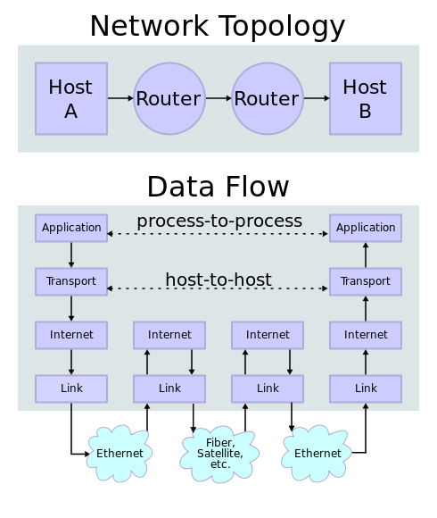
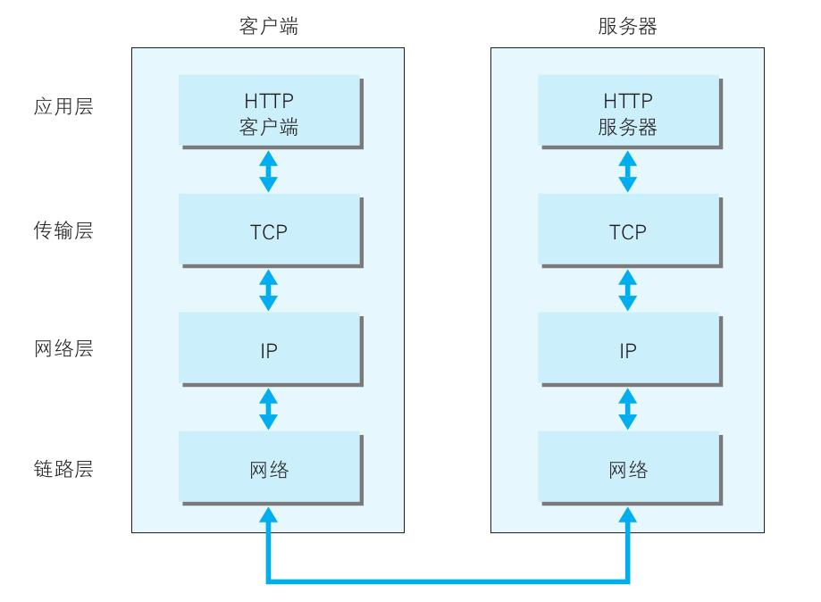
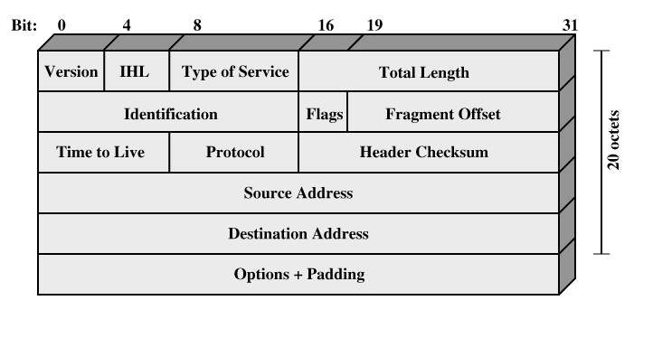
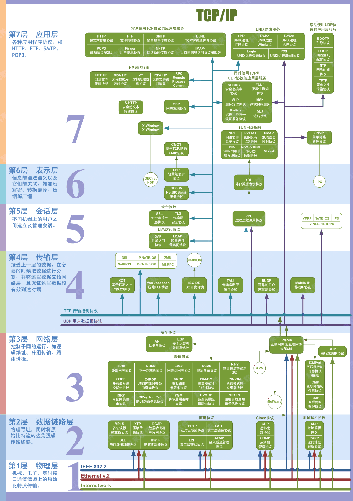
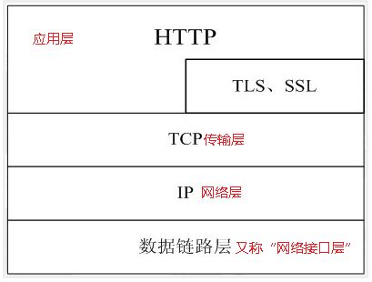

### For-learning-Go-Tutorial
Go语言是谷歌2009发布的第二款开源编程语言。

Go语言专门针对多处理器系统应用程序的编程进行了优化，使用Go编译的程序可以媲美C或C++代码的速度，而且更加安全、支持并行进程。

因而一直想的是自己可以根据自己学习和使用Go语言编程的心得，写一本Go的书可以帮助想要学习Go语言的初学者快速入门开发和使用！

#### 通信协议解析

在理解通信协议之前我们应该思考下为何会有协议呢？答案是因为有了网络,但是网络怎么来的呢，又是什么呢？

网络是由节点和连线构成，用来表示诸多对象及其相互联系。在数学上，网络是一种图，一般认为专指加权图。网络除了数学定义外，还有具体的物理含义，即网络是从某种相同类型的实际问题中抽象出来的模型。在计算机领域中，网络是信息传输、接收、共享的虚拟平台，通过它把各个点、面、体的信息联系到一起，从而实现这些资源的共享。但是网络的本质是为了解决多台计算机之间如何互相通信这个问题，从最初的ARPANET(Advanced Research Projects Agency Network) 到现在的 TCP/IP，这个本质问题并没有变化，只是技术不断改进。

在20世纪60年代，由于计算机网络飞速发展，各大厂商为了在数据通信网络领域占据主导地位，纷纷推出了各自的网络架构体系和标准，如IBM公司的SNA，Apple公司的AppleTalk协议，以及广泛流行的TCP/IP协议。同时，各大厂商针对自己的协议生产出了不同的硬件和软件。由于多种协议的并存，使得网络变得越来越复杂；而且，厂商之间的网络设备大部分不能兼容，很难进行通信。

因此为了解决网络之间的兼容性问题，帮助各个厂商生产出可兼容的网络设备，国际标准化组织ISO于1984年提出了OSI RM（OpenSystem Interconnection Reference Model，开放式系统互联通信参考模型），OSI 参考模型很快成为计算机网络通信的基础模型。

该体系结构定义了网络互连的七层框架（物理层、数据链路层、网络层、传输层、会话层、表示层和应用层），在这一框架下进一步详细规定了每一层的功能，以实现开放系统环境中的互连性、互操作性和应用的可移植性。

由于OSI模型和协议比较复杂，所以并没有得到广泛的应用。而TCP/IP(transfer control protocol/internet protocol,传输控制协议/网际协议)模型因其开放性和易用性在实践中得到了广泛的应用，TCP/IP协议栈也成为互联网的主流协议。

<p align="center">

</p>

两个因特网主机通过两个路由器和对应的层连接。各主机上的应用通过一些数据信道相互执行读取操作。

#### 结构目录

 * [网络层](#网络层)
 * [IP协议](#IP协议)
   * [IP报文](#IP报文)
   * [路由协议](#路由协议)
 * [ICMP协议](#ICMP协议)
 * [地址解析协议(ARP)](#地址解析协议(ARP))
 * [传输层](#传输层)
    * [UDP协议](#UDP协议)
    * [TCP协议](#TCP协议)
    * [TCP报文结构](#TCP报文结构)
    * [三次握手建立连接](#三次握手建立连接)
    * [四次握手断开连接](#四次握手断开连接)
 * [网络端口](#网络端口)
 * [网络套接字](#网络套接字)
 * [TCP,UDP区别](#TCP,UDP区别)
 * [应用层](#应用层)
    * [HTTP协议基础](#HTTP协议基础)
    * [消息报头](#消息报头)
    * [HTTP响应](#HTTP响应)
    * [状态行](#状态行)
    * [消息报头](#消息报头)
    * [响应正文](#响应正文)
    * [HTTP协议之Get和Post](#HTTP协议之Get和Post)
    * [HTTP不同版本区别](#HTTP不同版本区别)
    * [HTTP高级内容](#HTTP高级内容)
    * [Web缓存](#Web缓存)
    * [HTTP代理](#HTTP代理)
    * [HTTP与HTTPS区别](#Web缓存)
 
#### 网络层
网络层(network layer)是实现互联网的最重要的一层。正是在网络层面上，各个局域网根据IP协议相互连接，最终构成覆盖全球的Internet。更高层的协议，无论是TCP还是UDP，必须通过网络层的IP数据包(datagram)来传递信息。

<p align="center">

</p>

网络由下往上分为物理层、数据链路层、网络层、传输层、会话层、表示层和应用层。

```markdown
* 物理层：底层数据传输，如网线；网卡标准。 
* 数据链路层：定义数据的基本格式，如何传输，如何标识；如网卡MAC地址。
* 网络层：定义IP编址，定义路由功能；如不同设备的数据转发。
* 传输层：端到端传输数据的基本功能；如 TCP、UDP。
* 会话层：控制应用程序之间会话能力；如不同软件数据分发给不同软件。
* 表示层：数据格式标识，基本压缩加密功能。
* 应用层：各种应用软件，包括 Web 应用。
```

IP协议是TCP/IP协议的核心，所有的TCP，UDP，IMCP，IGCP的数据都以IP数据格式传输。IP不是可靠的协议，这是因为IP协议没有提供一种数据未传达以后的处理机制,这被认为是上层协议TCP或UDP要做的事情。

#### IP协议

整个的因特网就是一个单一的、抽象的网络。IP地址就是给因特网上的每一个主机（或路由器）的每一个接口分配一个在全世界范围内唯一的32位的标识符。

每个 32 位的 IP 地址由高位的可变长网络和低位的主机两部分组成。同一网络的所有主机，其地址的网络值是相同的。这意味着一个网络对应一块连续的 IP 地址空间，这块地址空间就称为地址的前缀。如果前缀包含 2^8 个主机地址，那么就留下了 24 位用于网络部分，可以写成 *.*.*.*/24。子网掩码用来与一个 IP 地址进行 AND 操作，提取出该 IP 地址的网络部分。

子网划分：在内部将一个网络块分成几个部分供多个内部网络使用，但对外部世界仍像单个网络一样。 路由聚合：把多个小前缀的地址块合并成一个大前缀的地址块。（解决路由表过大的问题）。

所谓分类的IP地址，就是将IP地址划分为若干固定类，每一类地址都由两个固定长度的字段组成，其中一个字段是网络号 net-id，它标志主机（或路由器）所连接到的网络，一个网络号在整个因特网范围内必须是唯一的。而另一个字段则是主机号 host-id，它标志该主机（或路由器），一个主机号在它前面的网络号所指明的网络范围内必须是唯一的。由此可见，一个IP地址在整个因特网范围内是唯一的。

由于一个路由器至少应当连接到两个网络（这样它才能将 IP 数据报从一个网络转发到另一个网络），因此一个路由器至少应当有两个不同的 IP 地址。用转发器或网桥连接起来的若干个局域网仍为一个网络，因此这些局域网都具有同样的网络号。路由器只根据目的站的IP 地址的网络号进行路由选择。

1953年，IP 地址被分为 5 个类别：
<p align="center">

</p>

全零（0.0.0.0）地址对应于当前主机。全1的IP地址（255.255.255.255）是当前子网的广播地址。

另外还有三个范围的 IP地址被声明为私有化，任何网络可以在内部随意地使用这些地址，但是不允许包含这些地址的数据包出现在 Internet 上。
* 1 个A类地址：10.0.0.0~10.255.255.255/8 (2^24 个地址).
* 16 个B类地址：172.16.0.0~172.31.255.255/16 (16 * 2^16 个地址).
* 256个C类地址：192.168.0.0~192.168.255.255/24 (256*2^8 个地址).

保留IP地址不会在internet网上出现，用于企业网络，A企业可以用,B企业也可以使用！

##### IP报文
<p align="center">

</p>

报头字段解析：

* 版本号（Version）：标识目前采用的IP协议的版本号。一般的值为0100（IPv4），IPv6的值（0110）
* 头部长度（Header Length）：这个字段的作用是为了描述IP包头的长度，因为在IP包中有变长的可选部分。
* 服务类型（Type of Service）：这个子段可以拆分成两个部分：Precedence和TOS。TOS目前不太使用。而Precedence则用于QOS应用。（TOS字段的详细描述RFC 1340 1349）
* 总长（Total Length）：长度16比特。IP包最大长度65535字节。
* 标识符（Identifier）：该字段和Flags和Fragment Offest字段联合使用，对大的上层数据包进行分段（fragment）操作。
* 标记（Flags）：该字段第一位不使用。第二位是DF位，DF位设为1时表明路由器不能对该上层数据包分段。如果一个上层数据包无法在不分段的情况下进行转发，则路由器会丢弃该上层数据包并返回一个错误信息。第三位是MF位，当路由器对一个上层数据包分段，则路由器会在除了最后一个分段的IP包的包头中将MF位设为1。
* 分段序号（Fragment Offset）：该字段对包含分段的上层数据包的IP包赋予序号。由于IP包在网络上传送的时候不一定能按顺序到达，这个字段保证了目标路由器在接受到IP包之后能够还原分段的上层数据包。到某个包含分段的上层数据包的IP包在传送是丢失，则整个一系列包含分段的上层数据包的IP包都会被要求重传。
* 生存时间（TTL）：TTL长度8 bit，最大值是255，TTL的一个推荐值是64。虽然从字面上翻译，TTL是IP数据包在计算机网络中的存在的最长时间。但实际上TTL是IP数据包在网络中可以转发的最大跳数。TTL字段由IP数据包的发送者设置，在IP数据包从源到目的的整个转发路径上，每经过一个路由器，把该TTL的值减1，然后再将IP包转发出去。如果在IP包到达目的IP之前，TTL减少为0，路由器将会丢弃收到的TTL=0的IP包并向发送者发送 ICMP time exceeded消息。TTL的主要作用是避免IP包在网络中的无限循环和收发，节省了网络带宽，并能使IP包的发送者能收到告警消息。这个字段可以防止由于故障而导致IP包在网络中不停被转发。
* 起源和目标地址（Source and Destination Addresses）：这两个地段都是32比特。标识了这个IP包的起源和目标地址。

##### 路由协议
在互联网中，网络结构是相当复杂的（存在复杂的局域网或广域网），若想要将数据包从一个主机成功发送到目的主机，则需要合理的路由将数据转发最终发送到目的主机。而要使路由能够正确的工作，需要路由控制模块和相关的`路由协议`来支持路由的工作。

#### ICMP协议
ICMP 是TCP/IP协议族的一个子协议，用于在IP主机、路由器之间传递控制消息。控制消息是指网络通不通、主机是否可达、路由是否可用等网络本身的消息。这些控制消息虽然并不传输用户数据，但是对于用户数据的传递起着重要的作用。

ICMP基于IP协议，也就是说，一个ICMP包需要封装在IP包中，然后在互联网传送。ICMP是IP套装的必须部分，任何一个支持IP协议的计算机，都要同时实现ICMP。

ICMP传输的控制信息可以分为两大类：
* 错误(error)信息：这一类信息可用来诊断网络故障。IP协议的工作方式是“Best Effort”，如果IP包没有被传送到目的地，或者IP包发生错误，IP协议本身不会做进一步的努力。但上游发送IP包的主机和接力的路由器并不知道下游发生了错误和故障，它们可能继续发送IP包。通过ICMP包，下游的路由器和主机可以将错误信息汇报给上游，从而让上游的路由器和主机进行调整。
* 咨询(Informational)信息：例如某台计算机询问路径上的每个路由器都是谁，然后各个路由器同样用ICMP包回答。

ICMP包有Type, Code和Checksum三部分：

* 类型：指明该数据包属于什么类型（大分类），长度1个字节。
* 代码：指明数据包属于大类里面的哪个小类，长度1个字节。类型字段与代码字段共同决定ICMP数据包类型，以及后续字段含义。
* 校验和： 指明该数据包的校验和，长度2个字节。该校验和覆盖整个ICMP数据包。

ICMP数据包通过类型字段与代码字段来共同决定该数据包传达的控制信息。常见的ICMP包类型：

* 0（Echo Reply）：属于咨询信息，ping命令就是利用了该类型的ICMP包。
* 3（Destination Unreachable）属于错误信息。如果一个路由器接收到一个IP包，不知道下一步往哪里发送，就会向出发主机发送该类型的ICMP包。
* 11（Time Exceeded）属于错误信息。IPv4中的Time to Live(TTL)会随着经过的路由器而递减，当这个区域值减为0时，就认为该IP包超时(Time Exceeded)。traceroute就利用了这种类型的ICMP包，它向目的地发送IP包，第一次的时候，将TTL设置为1，引发第一个路由器的Time Exceeded错误。这样，第一个路由器回复ICMP包，从而让出发主机知道途径的第一个路由器的信息。随后TTL被设置为2、3、4，...，直到到达目的主机。这样，沿途的每个路由器都会向出发主机发送ICMP包来汇报错误。traceroute将ICMP包的信息打印在屏幕上，就是接力路径的信息了。

#### 地址解析协议(ARP)

每个主机都会在自己的ARP缓冲区中建立一个ARP列表，以表示IP地址和MAC地址之间的对应关系。

当源主机要发送数据时，首先检查ARP列表中是否有对应IP地址的目的主机的MAC地址，如果有，则直接发送数据，如果没有，就向本网段的所有主机发送ARP数据包，该数据包包括的内容有：源主机 IP地址，源主机MAC地址，目的主机的IP地址。

当本网络的所有主机收到该ARP数据包时，首先检查数据包中的IP地址是否是自己的IP地址，如果不是，则忽略该数据包，如果是，则首先从数据包中取出源主机的IP和MAC地址写入到ARP列表中，如果已经存在，则覆盖，然后将自己的MAC地址写入ARP响应包中，告诉源主机自己是它想要找的MAC地址。

源主机收到ARP响应包后。将目的主机的IP和MAC地址写入ARP列表，并利用此信息发送数据。如果源主机一直没有收到ARP响应数据包，表示ARP查询失败。广播发送ARP请求，单播发送ARP响应。

RARP协议：反向地址转换协议，允许局域网的物理机器从网关服务器的ARP表或者缓存上请求其IP地址。其因为较限于IP地址的运用以及其他的一些缺点，因此渐为更新的BOOTP或DHCP所取代。

工作流程：在网络中配置一台RARP服务器，里面保存着IP地址和MAC地址的映射关系。当无盘工作站启动后，就封装一个RARP数据包，里面有其MAC地址，然后广播到网络上去，当服务器收到请求包后，就查找对应的MAC地址的IP地址装入响应报文中发回给请求者。因为需要广播请求报文，因此RARP只能用于具有广播能力的网络。

#### 传输层

TCP(Transmission Control Protocol)为应用程序之间提供面向连接的可靠的字节流服务。TCP为全双工协议，提供流控制机制，即允许接收方控制发送方的发送速度，此外还提供拥塞控制功能。

因特网的网络层只提供无连接、不可靠的尽力服务。它可以将分组从一个主机通过因特网传送到另一台主机，可能出现比特错、丢失、重复和错序到达的情形。

传输层建立在网络层之上，为进程之间的数据传输提供服务。传输层可以通过不可靠的因特网在两个进程之间建立一条可靠的逻辑链路，提供字节流传输服务。

因特网的传输层有两个协议UDP和TCP：
* UDP(User Datagram Protocol)只提供无连接的不可靠的服务，应用进程通过<远端IP地址，远端端口号>向远端进程发送数据，应用进程并不要求远端进程进行确认。
* TCP(Transmission Control Protocol)为应用程序之间提供面向连接的可靠的字节流服务。TCP为全双工协议，提供流控制机制，即允许接收方控制发送方的发送速度，此外还提供拥塞控制功能。


##### UDP协议

UDP（User Data Protocol，用户数据报协议）是与TCP相对应的协议。它是面向非连接的协议，它不与对方建立连接，而是直接就把数据包发送过去！

UDP 适用于一次只传送少量数据、对可靠性要求不高的应用环境。通常我们使用“ping”命令来测试两台主机之间TCP/IP通信是否正常，其实 “ping”命令的原理就是向对方主机发送UDP数据包，然后对方主机确认收到数据包，如果数据包是否到达的消息及时反馈回来，那么网络就是通的。例如， 在默认状态下，一次“ping”操作发送4个数据包。大家可以看到，发送的数据包数量是4包，收到的也是4包（因为对方主机收到后会发回一 个确认收到的数据包）。这充分说明了UDP协议是面向非连接的协议，没有建立连接的过程。正因为UDP协议没有连接的过程，所以它的通信效果高；但也正因为如此，它的可靠性不如TCP协议高。QQ就使用UDP发消息，因此有时会出现收不到消息的情况。 

##### TCP协议

TCP(传输控制协议)是应用程序之间的通信，是用固定的链接，当引用程序希望通过TCP与另一个应用程序通信时，它会发送一个通信请求，这个请求必须被送到一个确切的地址，在双方 “握手”之后，TCP将在两一个应用程序之间建立一个全双工的通信UDP 和 TCP 很相似，但是更简单，同时可靠性低于 TCP。

TCP/IP是个协议组，可分为四个层次：网络接口层、网络层、传输层和应用层。
* 网络层:在网络层有IP协议、ICMP协议、ARP协议、RARP协议和BOOTP协议。
* 传输层:在传输层中有TCP协议与UDP协议。
* 应用层:在应用层有FTP、HTTP、TELNET、SMTP、DNS等协议。

<p align="center">

</p>

该图为两个端点之间TCP通信,源主机的TCP进程从上层收集应用进程的数据，并在满足一定条件时发送出去，TCP发送的数据称为分段(Segment)。

##### TCP报文结构

TCP头部数据格式如下：

<p align="center">

</p>

各个字段的信息说明如下：

* Source Port(Destination Port)：分别占用16位，表示源端口号和目的端口号；用于区别主机中的不同进程，源端口号和目的端口号配合上IP首部中的源IP地址和目的IP地址就能唯一的确定一个TCP连接。

* Sequence Number：用来标识从TCP发送端向TCP接收端发送的数据字节流，它表示在这个报文段中的的第一个数据字节在数据流中的序号，主要用来解决网络报乱序的问题。

* Acknowledgment Number：发送确认的一端所期望收到的下一个序号，因此，确认序号应当是上次已成功收到数据字节序号加1。不过，只有当标志位中的ACK标志为1时该确认序列号的字段才有效，该字段主要用来解决丢包的问题。此外，TCP采用累计确认，即只有当确认字节之前的所有数据都到达之后才能发送确认，这样就可以用一个数字概括接收到的所有数据。

* Data offset：用来标识TCP头部的长度，该数字为头部中字(32 bit)的数目，需要这个值是因为任选字段的长度是可变的。这个字段占4bit，因此TCP最多有60字节的头部。然而，没有任选字段，正常的长度是20字节。

* Reserved：3个保留位，留作以后使用，全部设置为0。

* 标志位：TCP头部中共有9个标志位，用于操控TCP的状态，主要有URG，ACK，PSH，RST，SYN，FIN，标志位的意思如下：
  * URG：此标志表示TCP包的紧急指针域有效，用来保证TCP连接不被中断，并且督促中间层设备要尽快处理这些数据；
  * ACK：此标志表示应答域有效，就是说前面所说的TCP应答号将会包含在TCP数据包中；
  * PSH：表示Push操作，数据包到达接收端以后，立即传送给应用程序，而不是在缓冲区中排队；
  * RST：表示连接复位请求，用来复位那些产生错误的连接，也被用来拒绝错误和非法的数据包；
  * SYN：表示同步序号，用来建立连接。SYN标志位和ACK标志位搭配使用，当连接请求的时候，SYN=1，ACK=0；连接被响应的时候，SYN=1，ACK=1；
  * FIN：表示发送端已经达到数据末尾，也就是说双方的数据传送完成，没有数据可以传送了。
* Window Size：窗口大小，也就是有名的滑动窗口，用来进行流量控制。指定从被确认的字节算起可以发送多少个字节，窗口大小字段为0是合法的，说明已经接收到了 确认号－1 个字节，但是接收端没有来得及取走数据。

##### 三次握手建立连接

TCP协议提供可靠的连接服务，无论哪一方向另一方发送数据之前，都必须先在双方之间建立一条连接。在TCP/IP协议中，连接是通过三次握手进行初始化的，三次握手的过程如下：

<p align="center">

</p>

前两次握手，客户端进入连接状态，后两次握手，服务器进入连接状态。所以，三次握手之后，一个全双工的连接就建立起来了，之后，客户端和服务器端就可以开始传送数据。

* 第一次握手：客户端发送连接请求报文段，将SYN位设为1，SeqNum为随机数A；
* 第二次握手：服务器返回ACK，确认收到客户端发来的SYN，然后设置AckNum为A+1；此外，服务器发送自己的连接请求报文段，即发送SYN和随机数B作为SeqNum；
* 第三次握手：客户端返回ACK，确认收到服务器发来的SYN，然后设置AckNum=B+1。

但是我们为什么需要三次握手建立连接？

这是因为为了防止已失效的连接请求报文段突然又传送到了服务端，因而产生错误。

考虑下面一种情况：client发出的第一个连接请求报文段并没有丢失，而是在某个网络结点长时间的滞留了，以致延误到连接释放以后的某个时间才到达server。server收到此失效的连接请求报文段后，误认为是client发出的一个新的连接请求。于是就向client发出确认报文段，同意建立连接。

假设不采用“三次握手”，那么只要server发出确认，新的连接就建立了。由于现在client并没有发出建立连接的请求，因此不会理睬server的确认，也不会向server发送数据。但server却以为新的连接已经建立，并一直等待client发来数据。这样，server的很多资源就白白浪费掉了。

采用“三次握手”的办法可以防止上述现象发生。例如刚才那种情况，client不会向server的确认发出确认。server由于收不到确认，就知道client并没有要求建立连接。”

##### 四次握手断开连接

客户端和服务器数据传送完毕后，需要断开TCP连接，断开连接的时候需要进行四次握手。

<p align="center">

</p>

四次握手的过程如下：

* 第一次握手：发起端发送FIN和SeqNum=A，进入FIN_WAIT_1状态，用来关闭发起端到接收端的数据传送，也就是告诉接收端：不会再给你发新数据了(当然，在fin包之前发送出去的数据，如果没有收到对应的ack确认报文，发起端依然会重发这些数据)，但此时发起段还可以接受数据；

* 第二次握手：接收端收到FIN包后，发送一个ACK给对方，确认序号为收到序号+1（AckNum=A+1），此时接收端仍然可以给发起段发送数据（同意关闭连接请求，但是我还有数据需要传送，稍等...）；

* 第三次握手：接收端向发起端发送FIN，用来关闭到发起端的数据传送，也就是告诉发起端：我的数据也发送完了，不会再给你发数据了。此时接收端进入CLOSE_WAIT状态；

* 第四次握手：发起端发送ACK报文段，然后进入TIME_WAIT状态，接收端收到ACK报文段以后，就关闭连接。发起端等待2MSL后依然没有收到回复，则证明Server端已正常关闭，此时也可以关闭连接了。

如果要正确的理解四次握手失败的原理，还需要了解四次握手失败过程中的状态变化。

* FIN_WAIT_1: FIN_WAIT_1状态实际上是当SOCKET在ESTABLISHED状态时，它想主动关闭连接，向对方发送了FIN报文，此时该SOCKET即进入到FIN_WAIT_1状态。而当对方回应ACK报文后，则进入到FIN_WAIT_2状态。（主动方）

* FIN_WAIT_2：FIN_WAIT_2状态下的SOCKET，表示半连接，也即主动方要求断开连接，得到了被动方的确认，但被动方还有数据要发送，因此主动方还得继续接收。（主动方）

* TIME_WAIT: 表示收到了对方的FIN报文，并发送出了ACK报文，就等2MSL后即可回到CLOSED状态了。如果FINWAIT1状态下，收到了对方同时带FIN标志和ACK标志的报文时，可以直接进入到TIME_WAIT状态，而无须经过FIN_WAIT_2状态。（主动方）

* CLOSE_WAIT：在CLOSE_WAIT状态下，被动方还有数据需要传送。（被动方）

* LAST_ACK: 被动关闭一方在发送FIN报文后，最后等待对方的ACK报文。当收到ACK报文后，也即可以进入到CLOSED可用状态了。（被动方）

* CLOSED: 表示连接中断。

那么什么要四次握手断开连接？

TCP是全双工模式，这就意味着，当主机1发出FIN报文段时，只是表示主机1已经没有数据要发送了，主机1告诉主机2，它的数据已经全部发送完毕了；但是，这个时候主机1还是可以接受来自主机2的数据；当主机2返回ACK报文段时，表示它已经知道主机1没有数据发送了，但是主机2还是可以发送数据到主机1的；当主机2也发送了FIN报文段时，这个时候就表示主机2也没有数据要发送了，就会告诉主机1，我也没有数据要发送了，之后彼此就会中断这次TCP连接。

TIME_WAIT 状态存在的原因：

1. 可靠地实现TCP全双工连接的终止。

在进行关闭连接四次握手协议时，最后的ACK是由主动关闭端发出的，如果这个最终的ACK丢失，被动关闭方将重发最终的FIN，主动关闭端只有在维护状态信息的情况下才可以重新发送最终的那个ACK。如果不维护这个状态信息，主动关闭端将会响应一个RST，对端会将此响应标记为错误，所以不能进行正常的关闭。

2. 允许老的重复分节在网络中消逝。

假设TCP协议中不存在TIME_WAIT状态的限制，再假设当前有一条TCP连接：(local_ip, local_port, remote_ip,remote_port)，因某些原因，先关闭，接着很快以相同的四元组建立一条新连接。TCP协议栈是无法区分前后两条TCP连接的不同的，在它看来，这根本就是同一条连接，中间先释放再建立的过程对其来说是“感知”不到的。这样就可能发生这样的情况：前一条TCP连接由local peer发送的数据到达remote peer后，会被该remot peer的TCP传输层当做当前TCP连接的正常数据接收并向上传递至应用层（而事实上，在我们假设的场景下，这些旧数据到达remote peer前，旧连接已断开且一条由相同四元组构成的新TCP连接已建立，因此，这些旧数据是不应该被向上传递至应用层的），从而引起数据错乱进而导致各种无法预知的诡异现象。

local peer主动调用close后，此时的TCP连接进入TIME_WAIT状态，处于该状态下的TCP连接不能立即以同样的四元组建立新连接，即发起active close的那方占用的local port在TIME_WAIT期间不能再被重新分配。由于TIME_WAIT状态持续时间为2MSL，这样保证了旧TCP连接双工链路中的旧数据包均因过期（超过MSL）而消失，此后，就可以用相同的四元组建立一条新连接而不会发生前后两次连接数据错乱的情况。

<p align="center">

</p>
TCP 状态转换图

#### 网络端口

TCP 服务器由发送端和接收端创建一种称为套接字的端点来获得，每个套接字有一个套接字编号（地址），该编号由主机的 IP 地址以及一个本地的16位数值组成的。这个16位数值称为端口，所以一共有2^16 ＝ 65535个端口可用。

<p align="center">

</p>


1024以下的（不0包括1024）的端口被保留，只能用作由特权用户（比如UNIX系统的 root）启动的标准服务，这些端口称为知名端口。

通常会用到的端口：

|端口|协议|用途|
|---|---|---|
|20，21| FTP | 文件传输协议，21是控制端口，20是数据端口|
|22| SSH | 远程登录，Telnet的替代|
|23| Telnet | TELNET 终端仿真服务 |
|25| SMTP |简单邮件传输协议|
|53| DNS | 域名解析服务|
|80| HTTP| 万维网, 超文本传输服务|
|443| HTTPS| 安全的 Web|

1024～49151 之间的的其它端口可以通过 IANA 注册，由非特权用户使用，但是应用程序可以选择自己的端口号。

#### 网络套接字

网络上不同的计算机之间进行 TCP、UDP通信需要使用网络套接字（socket）。socket是在不同计算机之间进行通信的一个抽象。他工作于TCP/IP协议中应用层和传输层之间的一个抽象。

socket起源于UNIX，在Unix一切皆文件哲学的思想下，socket是一种"打开—读/写—关闭"模式的实现，服务器和客户端各自维护一个"文件"，在建立连接打开后，可以向自己文件写入内容供对方读取或者读取对方内容，通讯结束时关闭文件。

Socket也具有一个类似于打开文件的函数调用：Socket()，该函数返回一个整型的Socket描述符，随后的连接建立、数据传输等操作都是通过该Socket实现的。使用TCP/IP协议的应用程序通常采用应用编程接口：UNIX BSD的套接字（socket）和UNIX System V的TLI（已经被淘汰），来实现网络进程之间的通信。

* Socket 属性

套接字的特性由3个属性确定，它们分别是：域、类型和协议。

1. 套接字的域：它指定套接字通信中使用的网络介质，最常见的套接字域是AF_INET，它指的是Internet网络。当客户使用套接字进行跨网络的连接时，它就需要用到服务器计算机的IP地址和端口来指定一台联网机器上的某个特定服务，所以在使用socket作为通信的终点，服务器应用程序必须在开始通信之前绑定一个端口，服务器在指定的端口等待客户的连接。另一个域AF_UNIX表示UNIX文件系统，它就是文件输入/输出，而它的地址就是文件名。

2. 套接字类型：因特网提供了两种通信机制：流（stream）和数据报（datagram），因而套接字的类型也就分为流套接字和数据报套接字。这里主要讲流套接字。

流套接字由类型SOCK_STREAM指定，它们是在AF_INET域中通过TCP/IP连接实现，同时也是AF_UNIX中常用的套接字类型。流套接字提供的是一个有序、可靠、双向字节流的连接，因此发送的数据可以确保不会丢失、重复或乱序到达，而且它还有一定的出错后重新发送的机制。

与流套接字相对的是由类型SOCK_DGRAM指定的数据报套接字，它不需要建立连接和维持一个连接，它们在AF_INET中通常是通过UDP/IP协议实现的。它对可以发送的数据的长度有限制，数据报作为一个单独的网络消息被传输,它可能会丢失、复制或错乱到达，UDP不是一个可靠的协议，但是它的速度比较高，因为它并一需要总是要建立和维持一个连接。

3. 套接字协议：只要底层的传输机制允许不止一个协议来提供要求的套接字类型，我们就可以为套接字选择一个特定的协议。通常只需要使用默认值。

* Socket 接口函数

既然socket是“open—write/read—close”模式的一种实现，那么socket就提供了这些操作对应的函数接口。下面以TCP为例，介绍几个基本的socket接口函数。

`socket函数`：**使用给定的协议族、套接字类型、协议编号（默认为0）来创建套接字**。

socket函数对应于普通文件的打开操作。普通文件的打开操作返回一个文件描述字，而socket()用于创建一个socket描述符（socket descriptor），它唯一标识一个socket。这个socket描述字跟文件描述字一样，后续的操作都有用到它，把它作为参数，通过它来进行一些读写操作。

```markdown
int socket(int domain, int type, int protocol);
```
socket函数的三个参数分别为：

* domain：协议域。常用的协议族有AF_INET、AF_INET6等。协议族决定了socket的地址类型，在通信中必须采用对应的地址，如AF_INET决定了要用ipv4地址（32位的）与端口号（16位的）的组合。

* type：socket类型。常用的socket类型有，SOCK_STREAM、SOCK_DGRAM、SOCK_RAW、SOCK_PACKET、SOCK_SEQPACKET等等。

* protocol：指定协议。常用的协议有，IPPROTO_TCP、IPPTOTO_UDP等，它们分别对应TCP传输协议、UDP传输协议。

注意：type和protocol不可以随意组合的，如SOCK_STREAM不可以跟IPPROTO_UDP组合。当protocol为0时，会自动选择type类型对应的默认协议。

我们调用socket创建一个socket后，返回的socket描述符存在于协议族空间中，但没有一个具体的地址。如果想要给它赋值一个地址，就必须调用bind()函数，否则就当调用connect()、listen()时系统会自动随机分配一个端口。

* 服务器端函数

`bind函数`：**将套接字绑定到地址。**

    int bind(int sockfd, struct sockaddr * my_addr, int addrlen);


三个参数分别为：

* sockfd : 即socket描述字，通过socket()函数创建，唯一标识一个socket。
* my_addr : 结构体指针变量，指向要绑定给sockfd的协议地址。这个地址结构根据地址创建socket时的地址协议族的不同而不同。
* addrlen : 对应的是地址的长度。

通常服务器在启动的时候都会绑定一个地址（如ip地址+端口号），用于提供服务，客户就可以通过它来接连服务器；而客户端就不用指定，系统自动分配一个端口号和自身的ip地址组合。这就是为什么通常服务器端在listen之前会调用bind()，而客户端就不会调用，而是在connect()时由系统随机生成一个。

`listen函数`：使服务器的这个端口和IP处于监听状态，等待网络中某一客户机的连接请求。如果客户端有连接请求，端口就会接受这个连接。

    int listen(int sockfd, int backlog);

两个参数分别为：

* sockfd: socket描述字。
* backlog: 指定同时能处理的最大连接要求，通常为10或者5。最大值可设至128。

`accept函数`：接受远程计算机的连接请求，建立起与客户机之间的通信连接。服务器处于监听状态时，如果某时刻获得客户机的连接请求，此时并不是立即处理这个请求，而是将这个请求放在等待队列中，当系统空闲时再处理客户机的连接请求。

    int accept(int sockfd, struct sockaddr * addr,int * addrlen);

三个参数分别为：

* sockfd : socket描述字。
* addr: 为结构体指针变量，和bind的结构体是同种类型的，系统会把远程主机的信息（远程主机的地址和端口号信息）保存到这个指针所指的结构体中。
* addrlen : 表示结构体的长度

accept的第一个参数为服务器的socket描述字，是服务器开始调用socket()函数生成的，称为`监听socket描述字`；而accept函数返回的是`已连接的socket描述字`。一个服务器通常通常仅仅只创建一个监听socket描述字，它在该服务器的生命周期内一直存在。内核为每个由服务器进程接受的客户连接创建了一个已连接socket描述字，当服务器完成了对某个客户的服务，相应的已连接socket描述字就被关闭。

* 客户端函数

`connect函数`用来请求连接远程服务器.

    int connect (int sockfd,struct sockaddr * serv_addr,int addrlen);

三个参数分别为：

* sockfd : socket描述字，前面socket的返回值；
* serv_addr : 存储着远程服务器的IP与端口号信息；
* addrlen : 表示结构体变量的长度。

* 通用函数


`recv函数`：负责从缓冲区中读取内容。当读成功时，read返回实际所读的字节数，如果返回的值是0表示已经读到文件的结束了，小于0表示出现了错误。

    int recv(int sockfd,void *buf,int len,unsigned int flags);

四个参数分别为：

* sockfd : 为前面accept的返回值.也就是新的套接字。
* buf : 表示缓冲区
* len : 表示缓冲区的长度
* flags : 通常为0

`send函数`：将buf中的n bytes字节内容写入socket描述字。成功时返回写的字节数。失败时返回-1，并设置errno变量。

    int send(int sockfd,const void * msg,int len,unsigned int flags);

* sockfd : 为前面socket的返回值.
* msg : 一般为常量字符串
* len : 表示长度
* flags : 通常为0

`close函数`：关闭套接字。若顺利关闭则返回0，发生错误时返回-1。

    int close(int sockfd);

* TCP 通信

TCP中 Socket 通信的基本步骤如下：

<p align="center">

</p>

一个简单的 C/S 程序如下（客户端发出的数据, 服务器会回显到客户端的终端上。只是一个简单的模型, 没考虑错误处理等问题。）

服务器端如下：

```markdown
 import socket   # socket模块
    
    BUF_SIZE = 1024  # 设置缓冲区大小
    server_addr = ('127.0.0.1', 8888)  # IP和端口构成表示地址
    
    server = socket.socket(socket.AF_INET,
                           socket.SOCK_STREAM)   # 生成一个新的socket对象
    server.setsockopt(socket.SOL_SOCKET,
                      socket.SO_REUSEADDR, 1)    # 设置地址复用
    server.bind(server_addr)  # 绑定地址
    server.listen(5)          # 监听, 最大监听数为5
    while True:
        client, client_addr = server.accept()  # 接收TCP连接, 并返回新的套接字和地址
        print 'Connected by', client_addr
        while True:
            data = client.recv(BUF_SIZE)       # 从客户端接收数据
            print data
            client.sendall(data)               # 发送数据到客户端
    server.close()
```
客户端如下：

```markdown
 import socket

  BUF_SIZE = 1024
  server_addr = ('127.0.0.1', 8888)
  client = socket.socket(socket.AF_INET, socket.SOCK_STREAM)
  client.connect(server_addr)
  while True:
      data = raw_input("Please input some string > ")
      client.sendall(data)
      data = client.recv(BUF_SIZE)
      print data
  client.close()
```

不过真实的网络编程环境中，一定要使用大量的错误处理，可以尽量的发现错误，也能够使代码显得更加严谨。

三次握手
SYN_SENT    connect() 阻塞 --- accept() 阻塞 SYS_RCV
ESTABLISHED connect() 返回 --- accept() 返回 ESTABLISHED

四次挥手
FIN_WAIT1 close() 阻塞 --- read() 读 0 字节 LAST_ACK
FIN_WAIT2 close()


* UDP Socket函数 

`sendto()`函数：发送UDP数据，将数据发送到套接字。返回实际发送的数据字节长度或在出现发送错误时返回-1。

    int sendto(int sockfd, const void *msg,int len,unsigned int flags,const struct sockaddr *to, int tolen);

`recvfrom()`函数：接受UDP套接字的数据, 与recv()类似。返回接收到的字节数或当出现错误时返回-1，并置相应的errno。

    int recvfrom(int sockfd,void *buf,int len,unsigned int flags,struct sockaddr *from,int *fromlen);

UDP通信流程图如下：

<p align="center">

</p>


简单的客户端服务器UDP连接，服务器端：

    #!/usr/bin/env python
    # -*- coding:utf-8 -*-
    
    import socket
    
    BUF_SIZE = 1024                     # 设置缓冲区大小
    server_addr = ('127.0.0.1', 8888)   # IP和端口构成表示地址
        
    # 生成新的套接字对象
    server = socket.socket(socket.AF_INET, socket.SOCK_DGRAM)
    server.bind(server_addr)        # 套接字绑定IP和端口
        
    while True:
      print "waitting for data"
      # 从客户端接收数据
      data, client_addr = server.recvfrom(BUF_SIZE)
      print 'Connected by', client_addr, ' Receive Data : ', data
      # 发送数据给客户端
      server.sendto(data, client_addr)
    server.close()

客户端如下：

    import socket
    
    BUF_SIZE = 1024                     # 设置缓冲区
        server_addr = ('127.0.0.1', 8888)   # IP和端口构成表示地址
        
    client = socket.socket(socket.AF_INET, socket.SOCK_DGRAM)
    while True:
      data = raw_input('Please Input data > ')
      client.sendto(data, server_addr)  # 向服务器发送数据
      data, addr = client.recvfrom(BUF_SIZE)  # 从服务器接收数据
      print "Data : ", data
    client.close()

##### TCP,UDP区别

TCP协议和UDP协议特性区别，主要从连接性、可靠性、有序性、拥塞控制、传输速度、头部大小(Header size)等6个方面来讲。

1. TCP是面向连接的协议，UDP是无连接协议。TCP用三次握手建立连接，UDP发送数据前不需要建立连接；
2. TCP可靠，UDP不可靠。TCP丢包会重传，并且有确认机制，UDP不会；
3. TCP有序，UDP无序。消息在传输过程中可能会乱序，后发送的消息可能会先到达，TCP会对其进行重排序，UDP不会；
4. TCP 必须对数据进行校验，而UDP的校验是可选的；
5. TCP有流量控制（滑动窗口）和拥塞控制，UDP没有；
6. TCP传输慢，UDP传输快。因为TCP需要建立连接、保证可靠性和有序性，所以比较耗时。
7. TCP要建立连接、保证可靠性和有序性，就会传输更多的信息，包头比较大（TCP头部至少需要20字节，UDP头部只要8个字节）。

基于TCP的协议有：HTTP/HTTPS，Telnet，FTP，SMTP。 基于UDP的协议有：DHCP，DNS，SNMP，TFTP，BOOTP。


#### 应用层

* Http协议

HTTP协议是Hyper Text Transfer Protocol（超文本传输协议）的缩写,是用于从万维网(www:World Wide Web)服务器传输超文本到本地浏览器的传送协议。

HTTP是一个基于TCP/IP通信协议来传递数据（HTML 文件, 图片文件, 查询结果等）。

HTTP是一个属于应用层的面向对象的协议，由于其简捷、快速的方式，适用于分布式超媒体信息系统。HTTP是一个无状态的协议，也就是说服务器不会去维护与客户交互的相关信息，因此它对于事务处理没有记忆能力。为了解决HTTP无状态的问题，HTTP 引入了 Cookie 和 Session机制，用来保存客户端状态信息。

HTTP协议中，并没有规定它支持的层。事实上，HTTP可以在任何互联网协议上，或其他网络上实现。HTTP假定其下层协议提供可靠的传输，因此，任何能够提供这种保证的协议都可以被其使用，在TCP/IP协议族使用TCP作为其传输层。

<p align="center">

</p>

HTTP是一个无状态的协议，也就是说服务器不会去维护与客户交互的相关信息，因此它对于事务处理没有记忆能力。举个例子来讲，你通过服务器认证后成功请求了一个资源，紧接着再次请求这一资源时，服务器仍旧会要求你表明身份。

无状态不代表HTTP不能保持TCP连接，更不能代表HTTP使用的是UDP协议（无连接）。HTTP协议中，并没有规定它支持的层。事实上，HTTP可以在任何互联网协议上，或其他网络上实现。HTTP假定其下层协议提供可靠的传输，因此，任何能够提供这种保证的协议都可以被其使用，在TCP/IP协议族使用TCP作为其传输层，其在TCP/IP四层网络模型中的位置如下图所示：

<p align="center">

</p>

##### HTTP协议基础

* HTTP 请求

Http请求由三部分组成，分别是：请求行、消息报头、请求正文。

* 请求行

请求行的格式如下：

```markdown
Method SP Request-URI SP HTTP-Version CRLF
```

请求行以一个方法符号开头，后面跟着请求的URI和协议的版本，中间以空格隔开。其中

1. Method指出在由Request-URI标识的资源上所执行的方法，方法是大小写敏感的；
2. Request-URI是一个统一资源标识符(通过简单的格式化字符串，通过名称、位置、或其他任何特性标识某个资源)。
3. HTTP-Version 表示请求的HTTP协议版本；
4. CRLF表示回车和换行(除了作为结尾的 CRLF 外，不允许出现单独的 CR 或 LF 字符)


常用的请求方法如下： 

|方法名称          |含义             |
|-----------------|----------------| 
|GET              |获取由Request-URI标识的任何信息(以实体的形式)，如果Request-URI引用某个数据处理过程，则应该以它产生的数据作为在响应中的实体，而不是该过程的源代码文本，除非该过程碰巧输出该文本。 |
|POST             |用来请求原始服务器接受请求中封装的实体作为请求行中的Request-URI标识的副属。POST主要用于向数据处理过程提供数据块，如递交表单或者是通过追加操作来扩展数据库。 |
|PUT              |以提供的Request-URI存储封装的实体。 |
|DELETE           |请求原始服务器删除Request-URI标识的资源。 |
|HEAD             |除了服务器不能在响应中返回消息体，HEAD方法与GET相同。用来获取暗示实体的元信息，而不需要传输实体本身。常用于测试超文本链接的有效性、可用性和最近的修改。| 

简答例子如下：
```markdown
    GET /index.html HTTP/1.1
    POST http://192.168.2.223:8080/ HTTP/1.1
```

##### 消息报头

报头域是由名字+“:”+空格+值组成，消息报头域的名字是大小写无关的。请求消息报头包含了`普通报头、请求报头、实体报头`。

`普通报头`用于所有的请求和响应消息，但并不用于被传输的实体，只用于传输的消息。比如： 

* Cache-Control：用于指定缓存指令，缓存指令是单向的(响应中出现的缓存指令在请求中未必会出现)，且是独立的(一个消息的缓存指令不会影响另一个消息处理的缓存机制)；
* Date：表示消息产生的日期和时间；
* Connection：允许发送指定连接的选项，例如指定连接是连续，或者指定“close”选项，通知服务器在响应完成后关闭连接。

`请求报头`允许客户端向服务器端传递请求的附加信息以及客户端自身的信息。常用的请求报头如下： 

* Host：指定被请求资源的 Internet 主机和端口号，它通常是从HTTP URL中提取出来的；
* User-Agent：允许客户端将它的操作系统、浏览器和其它属性告诉服务器；
* Accept：指定客户端接受哪些类型的信息，eg:Accept:image/gif，表明客户端希望接受GIF图象格式的资源；
* Accept-Charset：指定客户端接受的字符集，缺省是任何字符集都可以接受；
* Accept-Encoding：指定可接受的内容编码，缺省是各种内容编码都可以接受；
* Authorization：证明客户端有权查看某个资源，当浏览器访问一个页面，如果收到服务器的响应代码为401(未授权)，可以发送一个包含Authorization请求报头域的请求，要求服务器对其进行验证。

`实体报头`定义了关于实体正文（eg：有无实体正文）和请求所标识的资源的元信息。常用的实体报头如下：

* Allow：GET,POST
* Content-Encoding：文档的编码（Encode）方法，例如：gzip；
* Content-Language：内容的语言类型，例如：zh-cn；
* Content-Length：表示内容长度，eg：80

##### HTTP响应

在接收和解释请求消息后，服务器返回一个 HTTP 响应消息。HTTP 响应也是由三个部分组成，分别是：`状态行、消息报头、响应正文`。

##### 状态行

所有HTTP响应的第一行都是状态行，依次是当前HTTP版本号，3位数字组成的状态代码，以及描述状态的短语，彼此由空格分隔。

> HTTP-Version Status-Code Reason-Phrase CRLF

HTTP状态码的作用：Web服务器用来告诉客户端，发生了什么事。状态代码的第一个数字代表当前响应的类型：

* 1xx消息——请求已被服务器接收，继续处理
* 2xx成功——请求已成功被服务器接收、理解、接受
* 3xx重定向——需要后续操作才能完成这一请求
* 4xx客户端错误——请求含有词法错误或者无法被执行
* 5xx服务器错误——服务器在处理某个正确请求时发生错误

虽然 RFC 2616 中已经推荐了描述状态的短语，例如"200 OK"，"404 Not Found"（“状态消息”更便于人理解）。但是WEB开发者仍然能够自行决定采用何种短语，用以显示本地化的状态描述或者自定义信息。常见的状态码有如下：

* 200 OK 服务器成功处理了请求；
* 206 Partial Content（部分内容）代表服务器已经成功处理了部分GET请求（只有发送GET 方法的request, web服务器才可能返回206）
* 301 Moved Permanently（永久重定向）请求的URL已移走。Response中应该包含一个Location URL, 说明资源现在所处的位置
* 302 Moved Temporarily（临时重定向） 
* 304 Not Modified（未修改）客户的缓存资源是最新的，要客户端使用缓存
* 400 Bad Request（坏请求）告诉客户端，它发送了一个错误的请求。
* 401 Unauthorized（未授权）需要客户端对自己认证
* 404 Not Found 未找到资源
* 500 Internal Server Error 服务器遇到一个错误，使其无法对请求提供服务

##### 消息报头

响应消息报头包含了普通报头、响应报头、实体报头，普通报头和实体报头和请求消息报头中的普通报头、实体报头相同。

响应报头允许服务器传递不能放在状态行中的附加响应信息，以及关于服务器的信息和 对 Request-URI 所标识的资源进行下一步访问的信息。常用的响应报头如下： 

* Location：用于重定向接受者到一个新的位置，Location响应报头域常用在更换域名的时候；
* Server：包含了服务器用来处理请求的软件信息，与User-Agent请求报头域是相对应的；
* WWW-Authenticate：必须被包含在401(未授权的)响应消息中。

##### 响应正文

消息正文类似HTTP请求的消息正文。

##### HTTP协议之Get和Post

Http协议定义了很多与服务器交互的方法，最基本的有4种，分别是GET, POST, PUT, DELETE。一个URL地址用于描述一个网络上的资源，而HTTP中的GET, POST, PUT, DELETE就对应着对这个资源的查，改，增，删4个操作。我们最常见的就是GET和POST了。GET一般用于**获取/查询**资源信息，而POST一般用于**更新**资源信息，主要区别如下：

1. GET提交的数据会放在URL之后，以?分割URL和传输数据，参数之间以&相连，如EditPosts.aspx?name=test1&id=123456。POST方法是把提交的数据放在HTTP包的Body中。
2. GET提交的数据大小有限制（因为`浏览器对URL的长度有限制`，实际上HTTP协议规范没有对URL长度进行限制），而POST方法提交的数据没有限制。
3. GET方式需要使用Request.QueryString来取得变量的值，而POST方式通过Request.Form来获取变量的值，也就是说Get是通过地址栏来传值，而Post是通过提交表单来传值。
4. 对于GET方式的请求，浏览器会把http header和data一并发送出去，服务器响应200（返回数据）；而对于POST，浏览器先发送header，服务器响应100 continue，浏览器再发送data，服务器响应200 ok（返回数据）。
5. GET方式提交数据，会带来安全问题，比如一个登录页面，通过GET方式提交数据时，用户名和密码将出现在URL上，如果页面可以被缓存或者其他人可以访问这台机器，就可以从历史记录获得该用户的账号和密码。
6. GET在浏览器回退时是无害的，而POST会再次提交请求。GET请求参数会被完整保留在浏览器历史记录里，而POST中的参数不会被保留。
7. 对参数的数据类型，GET只接受ASCII字符，而POST没有限制。

##### HTTP不同版本区别

HTTP/1.0版本，1.1版本主要区别如下：

* 带宽优化

HTTP/1.0中，存在一些浪费带宽的现象，例如客户端只是需要某个对象的一部分，而服务器却将整个对象送过来了。HTTP/1.1中在请求消息中引入了range头域，它允许只请求资源的某个部分。

另外一种情况是请求消息中如果包含比较大的实体内容，但不确定服务器是否能够接收该请求（如是否有权限），此时若贸然发出带实体的请求，如果被拒绝也会浪费带宽。HTTP/1.1加入了一个新的状态码100（Continue），客户端事先发送一个只带头域的请求，如果服务器因为权限拒绝了请求，就回送响应码401（Unauthorized）；如果服务器接收此请求就回送响应码100，客户端就可以继续发送带实体的完整请求了。

* 长连接

HTTP 1.0规定浏览器与服务器只保持短暂的连接，浏览器的每次请求都需要与服务器建立一个TCP连接，服务器完成请求处理后立即断开TCP连接，服务器不跟踪每个客户也不记录过去的请求。由于大多数网页的流量都比较小，一次TCP连接很少能通过slow-start区，不利于提高带宽利用率。

HTTP 1.1支持长连接（PersistentConnection）和请求的流水线（Pipelining）处理，在一个TCP连接上可以传送多个HTTP请求和响应，减少了建立和关闭连接的消耗和延迟。

HTTP 1.1还允许客户端不用等待上一次请求结果返回，就可以发出下一次请求，但服务器端必须按照接收到客户端请求的先后顺序依次回送响应结果，以保证客户端能够区分出每次请求的响应内容，这样也显著地减少了整个下载过程所需要的时间。

* 缓存

在HTTP/1.0 中，使用Expire头域来判断资源的fresh或stale，并使用条件请求来判断资源是否仍有效。例如，cache通过If-Modified-Since头域向服务器验证资源的Last-Modefied头域是否有更新，源服务器可能返回304（Not Modified），则表明该对象仍有效；也可能返回200（OK）替换请求的Cache对象。

HTTP/1.1在1.0的基础上加入了一些cache的新特性，当缓存对象的Age超过Expire时变为stale对象，cache不需要直接抛弃stale对象，而是与源服务器进行重新激活（revalidation）。

* Host头域

在 HTTP1.0 中认为每台服务器都绑定一个唯一的IP地址，因此请求消息中的URL并没有传递主机名（hostname）。但随着虚拟主机技术的发展，在一台物理服务器上可以存在多个虚拟主机（Multi-homed Web Servers），并且它们共享一个IP地址。HTTP1.1的请求消息和响应消息都支持Host头域，请求消息中如果没有Host头域会报告一个错误（400 Bad Request）。

* 错误提示

HTTP/1.0 中只定义了16个状态响应码，对错误或警告的提示不够具体。HTTP/1.1 引入了一个Warning头域，增加对错误或警告信息的描述。

此外，在HTTP/1.1中新增了24个状态响应码，如409（Conflict）表示请求的资源与资源的当前状态发生冲突；410（Gone）表示服务器上的某个资源被永久性的删除。

##### HTTP高级内容

* Cookie与Session

Cookie 和 Session 都为了用来保存状态信息，都是保存客户端状态的机制，它们都是为了解决HTTP无状态的问题而所做的努力。

* Cookie 机制

Cookie 就是浏览器储存在用户电脑上的一小段文本文件。Cookie 是纯文本格式，不包含任何可执行的代码。一个 Web 页面或服务器告知浏览器按照一定规范来储存这些信息，并在随后的请求中将这些信息发送至服务器，Web 服务器就可以使用这些信息来识别不同的用户。大多数需要登录的网站在用户验证成功之后都会设置一个 Cookie，只要这个Cookie 存在并可以，用户就可以自由浏览这个网站的任意页面。

Cookie 会被浏览器自动删除，通常存在以下几种原因：

1. 会话 cooke (Session cookie) 在会话结束时（浏览器关闭）会被删除.

2. 持久化 cookie（Persistent cookie）在到达失效日期时会被删除.

3. 如果浏览器中的 cookie 数量达到限制，那么 cookie 会被删除以为新建的 cookie 创建空间.

大多数浏览器支持最大为 4096 字节的 Cookie。由于这限制了 Cookie 的大小，最好用 Cookie 来存储少量数据，或者存储用户 ID 之类的标识符。用户 ID 随后便可用于标识用户，以及从数据库或其他数据源中读取用户信息。 浏览器还限制站点可以在用户计算机上存储的 Cookie 的数量。大多数浏览器只允许每个站点存储 20 个 Cookie；如果试图存储更多 Cookie，则最旧的 Cookie 便会被丢弃。有些浏览器还会对它们将接受的来自所有站点的 Cookie 总数作出绝对限制，通常为 300 个。

使用 Cookie 的缺点：

* 不良站点用 Cookie 收集用户隐私信息；
* Cookie窃取：黑客以可以通过窃取用户的Cookie来模拟用户的请求行为。（跨站脚本攻击XSS）

* Session 机制

Session机制是一种服务器端的机制，服务器使用一种类似于散列表的结构（也可能就是使用散列表）来保存信息。当程序需要为某个客户端的请求创建一个session的时候，服务器首先检查这个客户端的请求里是否已包含了一个session标识（session id）：

* 如果已包含一个session id 则说明以前已经为此客户端创建过session，服务器就按照session id把这个 session 检索出来使用（如果检索不到，可能会新建一个）。

* 如果客户端请求不包含session id，则为此客户端创建一个session并且生成一个与此session相关联的session id，session id的值应该是一个既不会重复，又不容易被找到规律以仿造的字符串，这个 session id将被在本次响应中返回给客户端保存。

具体实现方式：

* Cookie方式：服务器给每个Session分配一个唯一的JSESSIONID，并通过Cookie发送给客户端。当客户端发起新的请求的时候，将在Cookie头中携带这个JSESSIONID，这样服务器能够找到这个客户端对应的Session。

* URL回写：服务器在发送给浏览器页面的所有链接中都携带JSESSIONID的参数，这样客户端点击任何一个链接都会把JSESSIONID带回服务器。如果直接在浏览器输入服务端资源的url来请求该资源，那么Session是匹配不到的。

#### Web缓存

WEB缓存(cache)位于Web服务器和客户端之间，缓存机制会根据请求保存输出内容的副本，例如html页面，图片，文件，当下一个请求来到的时候：如果是相同的URL，缓存直接使用副本响应访问请求，而不是向源服务器再次发送请求。

有缓存的 Get 请求过程如下：

<p align="center">

</p>

主要分三种情况:

1. 未找到缓存(黑色线)：当没有找到缓存时，说明本地并没有这些数据，这种情况一般发生在我们首次访问网站，或者以前访问过，但是清除过缓存后。浏览器就会先访问服务器，然后把服务器上的内容取回来，内容取回来以后，就要根据情况来决定是否要保留到缓存中了。

2. 缓存未过期(蓝色线)：缓存未过期，指的是本地缓存没有过期，不需要访问服务器了，直接就可以拿本地的缓存作为响应在本地使用了。这样节省了不少网络成本，提高了用户体验过。

3. 缓存已过期(红色线)：当满足过期的条件时，会向服务器发送请求，发送的请求一般都会进行一个验证，
