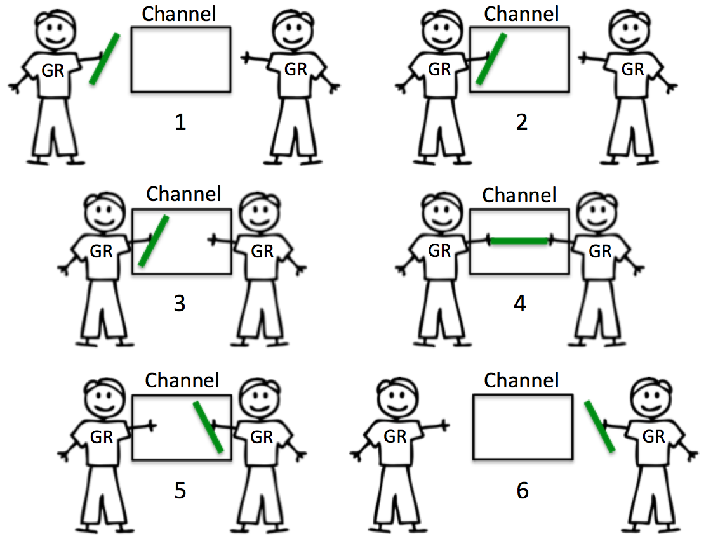
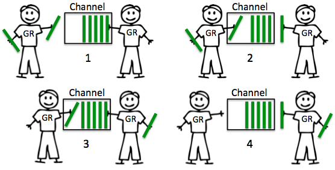

### For-learning-Go-Tutorial
Go语言是谷歌2009发布的第二款开源编程语言

Go语言专门针对多处理器系统应用程序的编程进行了优化，使用Go编译的程序可以媲美C或C++代码的速度，而且更加安全、支持并行进程。

因而一直想的是自己可以根据自己学习和使用Go语言编程的心得，写一本Go的书可以帮助想要学习Go语言的初学者快速入门开发和使用！

#### Channel
Channel是Go中的一个核心类型，你可以把它看成一个管道，通过它并发核心单元就可以发送或者接收数据进行通讯(communication).

Channel用于数据传递或数据共享，其本质上是一个先进先出的队列，使用Goroutine 和channel进行数据通讯简单高效，同时也线程安全，多个Goroutine可同时修改一个Channel，不需要加锁。

管道是一系列由channel联通的状态（stage），而每个状态是一组运行相同函数的Goroutine。在每个状态的Goroutine上:

* 通过流入（inbound）channel接收上游的数值.
* 运行一些函数来处理接收的数据，一般会产生新的数值.
* 通过流出（outbound）channel将数值发给下游.

每个语态都会有任意个流入或者流出channel，除了第一个状态（只有流出channel）和最后一个状态（只有流入channel）。第一个状态有时被称作源或者生产者；最后一个状态有时被称作槽（sink）或者消费者。

我们先从简单开始使用内置的make函数,创建一个Channel:
```go
ch := make(chan int)
````
然而每个channel都有一个特殊的类型,也就是channels可发送数据的类型。一个可以发送int类型数据的channel一般写为chan int，一个channel有发送和接受两个主要操作,都是通信行为。一个发送语句将一个值从一个goroutine通过channel发送到另一个执行接收操作的goroutine。发送和接收两个操作都是用<-运算符。
```go
ch <- p    // 发送值p到Channel ch中
p := <-ch  // 从Channel ch中接收数据，并将数据赋值给p
```
注意：在channel中箭头的指向是数据的流向．

和map类似,channel也一个对应make创建的底层数据结构的引用。当我们复制一个channel或用于函数参数传递时,我们只是拷贝了一个channel引用,因此调用者何被调用者将引用同一个channel对象。和其它的引用类型一样,channel的零值也是nil。两个相同类型的channel可以使用==运算符比较。如果两个channel引用的是相通的对象,那么比较的结果为真。一个channel也可以和nil进行比较。

Channel类型的定义格式：

```go
ChannelType = ( "chan" | "chan" "<-" | "<-" "chan" ) Type .
```

它包括三种类型的定义。可选的<-代表channel的方向。如果没有指定方向，那么Channel就是双向的，既可以接收数据，也可以发送数据。

```go
chan p            // 可以接收和发送类型为p的数据
chan<- float64   // 只可以用来发送 float64 类型的数据
<-chan int       // 只可以用来接收 int 类型的数据
```

这里需要注意下：<-总是优先和最左边的类型结合。

使用make初始化Channel,我们还可以设置channel的容量,容量(capacity)代表Channel容纳的最多的元素的数量，代表Channel的缓存的大小。
```go
ch = make(chan int)    // 无缓冲 channel
ch = make(chan int, 0) // 无缓冲 channel
ch = make(chan int, 3) // 缓冲 channel容量是3
```
如果没有设置容量，或者容量设置为0, 说明Channel没有缓存，只有sender和receiver都准备好了后它们的通讯(communication)才会发生(Blocking)。如果设置了缓存，就有可能不发生阻塞， 只有buffer满了后 send才会阻塞， 而只有缓存空了后receive才会阻塞。一个nil channel不会通信。

##### 无缓冲的Channels

无缓冲：发送和接收动作是同时发生的Channels的发送和接收操作将导致两个goroutine做一次同步操作。因为这个原因，无缓存Channels有时候也被称为同步Channels
。如果没有 goroutine 读取 channel （<- channel），则发送者 (channel <-) 会一直阻塞。

<p align="center">

</p>

##### 缓冲的Channels

缓冲：缓冲 channel 类似一个有容量的队列。当队列满的时候发送者会阻塞；当队列空的时候接收者会阻塞。

<p align="center">

</p>

此外在使用channel之后可以进行关闭，关闭channel后,对该channel的任何发送操作都将导致panic异常。对一个已经被close过的channel之行接收操作依然可以接受到之前已经成功发送的数据;如果channel中已经没有数据的话讲产生一个零值的数据。

使用内置的close函数就可以关闭一个channel:
```go
close(ch)
```
但是关于关闭channel 有几点需要注意:

* 重复关闭 channel 会导致 panic.
* 向关闭的 channel 发送数据会 panic.
* 从关闭的 channel 读数据不会 panic，读出channel中已有的数据之后再读就是channel类似的默认值，比如 chan int 类型的channel关闭之后读取到的值为 0.

这里我们需要区分一下第三种channel 中的值是默认值还是channel 关闭了。可以使用 ok-idiom 方式，这种方式在 map 中比较常用.
```go
ch := make(chan int, 10)
...
close(ch)

// ok-idiom 
val, ok := <-ch
if ok == false {
    // channel closed
}
```

####  Channel的典型用法

*  goroutine 使用channel通信
```go
func main() {
    x := make(chan int)
    go func() {
        x <- 1
    }()
    <-x
}
```

* select

select语句选择一组可能的send操作和receive操作去处理。它类似switch,但是只是用来处理通讯(communication)操作。它的case可以是send语句，也可以是receive语句，亦或者default。

receive语句可以将值赋值给一个或者两个变量。它必须是一个receive操作。

select在一定程度上可以类比于linux中的 IO 多路复用中的 select。后者相当于提供了对多个 IO 事件的统一管理，而 Golang 中的 select 相当于提供了对多个 channel 的统一管理。当然这只是 select 在 channel 上的一种使用方法。
```go
select {
    case e, ok := <-ch1:
        ...
    case e, ok := <-ch2:
        ...
    default:  
}
```
这里需要注意的是 select 中的 break 只能跳到 select 这一层。select 使用的时候一般需要配合 for 循环使用，因为正常 select 里面的流程也就执行一遍。这么来看 select 中的 break 就稍显鸡肋了。所以使用 break 的时候一般配置 label 使用，label 定义在 for循环这一层。
```go
for {
    select {
        ...
    }
}
```

* range channel

使用range channel 我们可以直接取到 channel 中的值。当我们使用 range 来操作 channel 的时候，一旦 channel 关闭，channel 内部数据读完之后循环自动结束。
```go
func consumer(ch chan int) {
    for x := range ch {
        fmt.Println(x)
        ...
    }
}

func producer(ch chan int) {
  for _, v := range values {
      ch <- v
  }  
}
```

* 超时控制

select有很重要的一个应用就是超时处理。由于如果没有case需要处理，select语句就会一直阻塞着。这时候我们可能就需要一个超时操作，用来处理超时的情况通常在很多操作情况下都需要超时控制，我们可以利用 select 实现超时控制:
```go
func main() {
    c1 := make(chan string, 1)
    go func() {
        time.Sleep(time.Second * 2)
        c1 <- "result 1"
    }()
    select {
    case res := <-c1:
        fmt.Println(res)
    case <-time.After(time.Second * 1):
        fmt.Println("timeout 1")
    }
}
```
这里利用的是time.After方法，它返回一个类型为<-chan Time的单向的channel，在指定的时间发送一个当前时间给返回的channel中。

* channel同步

channel可以用在goroutine之间的同步。
下面的例子main中goroutine通过done channel等待 mission完成任务。 mission做完任务后只需往channel发送一个数据就可以通知main goroutine任务完成。

```go
func mission(done chan bool) {
	time.Sleep(time.Second)
	// 通知任务已完成
	done <- true
}
func main() {
	done := make(chan bool, 1)
	go mission(done)
	// 等待任务完成
	<-done
}
```

在Golang中的channel 将goroutine 隔离开，并发编程的时候可以将注意力放在 channel 上。在一定程度上，这个和消息队列的解耦功能还是挺像的。

##### 扇出和扇入

通常情况下多个函数可以同时从一个channel接收数据，直到channel关闭，这种情况被称作扇出。这是一种将工作分布给一组工作者的方法，目的是并行使用CPU和I/O。

如果一个函数同时接收并处理多个channel输入并转化为一个输出channel，直到所有的输入channel都关闭后，关闭输出channel，这种情况就被称作扇入。

但是main可以容易的通过关闭done　channel来释放所有的发送者。关闭是个高效的发送给所有发送者的信号。我们扩展channel管道里的每个函数，让其以参数方式接收done，并通过defer语句在函数退出时执行关闭操作，这样main里所有的退出路径都会触发管道里的所有状态退出。

```go
func main() {
   // 构建done channel，整个管道里分享done，并在管道退出时关闭这个channel
    // 以此通知所有Goroutine该推出了。
    done := make(chan struct{})
    defer close(done)

    in := gen(done, 2, 3)

    // 发布sq的工作到两个都从in里读取数据的Goroutine
    c1 := sq(done, in)
    c2 := sq(done, in)

    // 处理来自output的第一个数值
    out := merge(done, c1, c2)
    fmt.Println(<-out) // 4 或者 9

    // done会通过defer调用而关闭
}

func sq(in <-chan int) <-chan int {
    out := make(chan int)
    go func() {
        for n := range in {
            out <- n*n
        }
        close(out)
    }()
    return out
}
```

merge对每个流入channel启动一个Goroutine，并将流入的数值复制到流出channel，由此将一组channel转换到一个channel。一旦启动了所有的output  Goroutine，merge函数会多启动一个Goroutine，这个Goroutine在所有的输入channel输入完毕后，关闭流出channel。sq函数是把上一个函数的chan最为参数，下一个输出的chan作为返回值。

但是往一个已经关闭的channel输出会产生异常（panic），所以一定要保证所有数据发送完成后再执行关闭。

所以发送Goroutine将发送操作替换为一个select语句，要么把数据发送给out，要么处理来自done的数值。done的类型是个空结构，因为具体数值并不重要：接收事件本身就指明了应当放弃继续发送给out的动作。而output Goroutine会继续循环处理流入的channel，c,而不会阻塞上游状态.

```go
//gen函数启动一个Goroutine，将整数数列发送给channel，如果所有数都发送完成，关闭这个channel
func gen(nums ...int) <-chan int {
 out := make(chan int, len(nums))
    for _, n := range nums {
        out <- n
    }
    close(out)
    return out
}

// 从一个channel接收整数，并求整数的平方，发送给另一个channel.
// mission的循环中退出，因为我们知道如果done已经被关闭了，也会关闭上游的gen状态.
// mission通过defer语句，保证不管从哪个返回路径，它的out channel都会被关闭.


func mission(in <-chan int) <-chan int {
    out := make(chan int)
    go func() {
        defer close(out)
        for n := range in {
            select {
            case out <- n * n:
            case <-done:
                return
            }
        }
    }()
    return out
}


func merge(cs ...<-chan int) <-chan int {
    var wg sync.WaitGroup
    out := make(chan int)

    // 为每个cs中的输入channel启动一个output Goroutine。outpu从c里复制数值直到c被关闭
    // 或者从done里接收到数值，之后output调用wg.Done
    output := func(c <-chan int) {
        for n := range c {
            select {
            	case out <- n:
            	case <-done:
            }
        }
        wg.Done()
    }
    wg.Add(len(cs))
    for _, c := range cs {
        go output(c)
    }

    // 启动一个Goroutine，当所有output Goroutine都工作完后（wg.Done），关闭out，
    // 保证只关闭一次。这个Goroutine必须在wg.Add之后启动
    go func() {
        wg.Wait()
        close(out)
    }()
    return out
}
```
在channel模式中有个模式:

* 状态会在所有发送操作做完后，关闭它们的流出channel

* 状态会持续接收从流入channel输入的数值，直到channel关闭

这个模式使得每个接收状态可以写为一个range循环，并保证所有的Goroutine在将所有的数值发送成功给下游后立刻退出。

所以在构建channel的时候:

* 状态会在所有发送操作做完后，关闭它们的流出channel.
* 状态会持续接收从流入channel输入的数值，直到channel关闭或者其发送者被释放.

因而管道要么保证足够能存下所有发送数据的缓冲区，要么接收来自接收者明确的要放弃channel的信号，来保证释放发送者。
