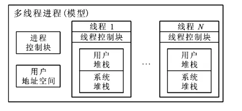

### For-learning-Go-Tutorial

Go语言是谷歌2009发布的第二款开源编程语言

Go语言专门针对多处理器系统应用程序的编程进行了优化，使用Go编译的程序可以媲美C或C++代码的速度，而且更加安全、支持并行进程。

因而一直想的是自己可以根据自己学习和使用Go语言编程的心得，写一本Go的书可以帮助想要学习Go语言的初学者快速入门开发和使用！

#### Goroutine并发处理

在了解Goroutine并发之前，我们需要先了解下进程和线程,并发与并行 (Concurrency and Parallelism)的概念。

* 进程

进程是操作系统中进行保护和资源分配的基本单位，操作系统分配资源以进程为基本单位。

cpu在切换程序的时候，如果不保存上一个程序的状态（也就是我们常说的context--上下文），直接切换下一个程序，就会丢失上一个程序的一系列状态，于是引入了进程这个概念，用以划分好程序运行时所需要的资源。因此进程就是一个程序运行时候的所需要的基本资源单位（也可以说是程序运行的一个实体）。

* 线程

线程是进程的组成部分，它代表了一条顺序的执行流。

cpu切换多个进程的时候，会花费不少的时间，因为切换进程需要切换到内核态，而每次调度需要内核态都需要读取用户态的数据，进程一旦多起来，cpu调度会消耗一大堆资源，因此引入了线程的概念，线程本身几乎不占有资源，他们共享进程里的资源，内核调度起来不会那么像进程切换那么耗费资源。

* 协程

协程拥有自己的寄存器上下文和栈。协程调度切换时，将寄存器上下文和栈保存到其他地方，在切回来的时候，恢复先前保存的寄存器上下文和栈。因此，协程能保留上一次调用时的状态（即所有局部状态的一个特定组合），每次过程重入时，就相当于进入上一次调用的状态，换种说法：进入上一次离开时所处逻辑流的位置。线程和进程的操作是由程序触发系统接口，最后的执行者是系统；协程的操作执行者则是用户自身程序，goroutine也是协程。

<p align="center">

</p>

进程是从操作系统获得基本的内存空间，所有的线程共享着进程的内存地址空间。此外，每个线程也会拥有自己私有的内存地址范围，其他线程不能访问。然而由于所有的线程共享进程的内存地址空间，所以线程间的通信就非常容易，通过共享进程级全局变量就可以实现线程间的通信。

* 并发

并发是指程序的逻辑结构,交替做不同事的能力,在这里通常是不同程序交替执行的性能。

* 并行

并行是指程序的运行状态,同时做不同事的能力,在这里通常是指不同程序同时执行的性能。

如果某个系统支持两个或者多个动作（Action）同时存在，那么这个系统就是一个**并发系统**。如果某个系统支持两个或者多个动作同时执行，那么这个系统就是一个**并行系统**。

并发系统与并行系统这两个定义之间的关键差异在于“存在”这个词。在并发程序中可以同时拥有两个或者多个线程。这意味着，如果程序在单核处理器上运行，那么这两个线程将交替地换入或者换出内存。这些线程是同时“存在”的——每个线程都处于执行过程中的某个状态。如果程序能够并行执行，那么就一定是运行在多核处理器上。

此时，程序中的每个线程都将分配到一个独立的处理器核上，因此可以同时运行。这里相信你已经能够得出结论——“并行”概念是“并发”概念的一个子集。也就是说，你可以编写一个拥有多个线程或者进程的并发程序，但如果没有多核处理器来执行这个程序，那么就不能以并行方式来运行代码。因此，凡是在求解单个问题时涉及多个执行流程的编程模式或者执行行为，都属于并发编程的范畴。

理解了并发和并行后，我们在看看Goroutine.

Goroutine 的概念类似于线程，但 Goroutine 由 Go 程序运行时的调度和管理。Go 程序会将Goroutine 中的任务合理地分配给每个 CPU。Go 程序从 main 包的 main() 函数开始，在程序启动时，Go 程序就会为 main() 函数创建一个默认的 Goroutine。

Goroutine是Go语言原生支持并发的具体实现，在Go中的代码都是运行在Goroutine中的。Goroutine占用的资源非常小(Go 1.4将每个Goroutine stack的size默认设置为2k)，goroutine调度的切换也不用陷入(trap)操作系统内核层完成，代价很低。因此，一个Go程序中可以创建成千上万个并发的goroutine。

所有的Go代码都在goroutine中执行，即使是go的runtime也不例外。我们可以启动成千上万的goroutine，但是Go的runtime负责对goroutine进行调度。这里的调度就是决定何时哪个goroutine将获得资源开始执行、哪个goroutine应该停止执行让出资源、哪个goroutine应该被唤醒恢复执行等.

但是很多人其实并没有深入的了解过Goroutine的调度模型和原理，那么Goroutine是怎么实现调度的呢？

Go的调度器内部有三个重要的结构：G P M.

* G: 表示goroutine，存储了goroutine的执行stack信息、goroutine状态以及goroutine的任务函数等；另外G对象是可以重用的。
```go
struct G {
    uintptr    stackguard;  // 分段栈的可用空间下界
    uintptr    stackbase;   // 分段栈的栈基址
    Gobuf      sched;       //进程切换时，利用sched域来保存上下文
    uintptr    stack0;
    FuncVal*   fnstart;     // goroutine运行的函数
    void*      param;       // 用于传递参数，睡眠时其它goroutine设置param，唤醒时此goroutine可以获取
    int16      status;      // 状态Gidle,Grunnable,Grunning,Gsyscall,Gwaiting,Gdead
    int64      goid;        // goroutine的id号
    G*         schedlink;
    M*         m;           // for debuggers, but offset not hard-coded
    M*         lockedm;     // G被锁定只能在这个m上运行
    uintptr    gopc;        // 创建这个goroutine的go表达式的pc
    ...
}
```
结构体G中的部分域如上所示。其中包含了栈信息stackbase和stackguard，还有运行的函数信息fnstart。这样就可以成为一个可执行的单元了，只要得到CPU就可以运行。goroutine切换时，上下文信息保存在结构体的sched域中。goroutine是轻量级的线程或者称为协程，切换时并不必陷入到操作系统内核中，所以保存过程很轻量。

而G中的Gobuf，只保存了当前栈指针，程序计数器，以及goroutine自身。
```go
struct Gobuf {
    // The offsets of these fields are known to (hard-coded in) libmach.
    uintptr    sp;
    byte*      pc;
    G*         g;
    ...
}
```
这里g是为了恢复当前goroutine的结构体G指针，运行时库中使用了一个常驻的寄存器extern register G* g，这个是当前goroutine的结构体G的指针。这样做是为了快速地访问goroutine中的信息.

* P:  表示逻辑processor 代表cpu，P的数量决定了系统内最大可并行的G的数量（系统的物理cpu核数>=P的数量）；P的最大作用还是其拥有的各种G对象队列、链表、一些cache和状态。

在代码中结构体P的加入是为了提高Go程序的并发度，实现更好的调度。M代表OS线程。P代表Go代码执行时需要的资源。当M执行Go代码时，它需要关联一个P，当M为idle或者在系统调用中时，它也需要P。有刚好GOMAXPROCS个P。所有的P被组织为一个数组，在P上实现了工作流窃取的调度器。
```go
struct P {
    Lock;
    uint32    status;       // Pidle或Prunning等
    P*        link;
    uint32    schedtick;    // 每次调度时将它加一
    M*        m;           // 链接到它关联的M (nil if idle)
    MCache*   mcache;

    G*        runq[256];
    int32     runqhead;
    int32     runqtail;

    // Available G's (status == Gdead)
    G*        gfree;
    int32     gfreecnt;
    byte      pad[64];
}
```
在P中有一个Grunnable的goroutine队列，这是一个P的局部队列。当P执行Go代码时，它会优先从自己的这个局部队列中取，这时可以不用加锁，提高了并发度。如果发现这个队列空了，则去其它P的队列中拿一半过来，这样实现工作流窃取的调度。这种情况下是需要给调用器加锁的。

* M: M代表着执行计算资源。在绑定有效的p后，进入schedule循环；而schedule循环的机制大致是从各种队列、p的本地队列中获取G，切换到G的执行栈上并执行G的函数，调用goexit做清理工作并回到m，如此反复。M并不保留G状态，这是G可以跨M调度的基础。

M是machine的缩写，是对机器的抽象，每个m都是对应到一条操作系统的物理线程。M必须关联了P才可以执行Go代码，但是当它处理阻塞或者系统调用中时，可以不需要关联P。
```go
struct M {
    G*       g0;                 // 带有调度栈的goroutine
    G*       gsignal;            // signal-handling G 处理信号的goroutine
    void     (*mstartfn)(void);
    G*       curg;               // M中当前运行的goroutine
    P*       p;                  // 关联P以执行Go代码 (如果没有执行Go代码则P为nil)
    P*       nextp;
    int32    id;
    int32    mallocing;         //状态
    int32    throwing;
    int32    gcing;
    int32    locks;
    int32    helpgc;            //不为0表示此m在做帮忙gc。helpgc等于n只是一个编号
    bool     blockingsyscall;
    bool     spinning;
    Note     park;
    M*       alllink;          // 这个域用于链接allm
    M*       schedlink;
    MCache   *mcache;
    G*       lockedg;
    M*       nextwaitm;       // next M waiting for lock
    GCStats  gcstats;
    ...
}
```
和G类似，M中也有alllink域将所有的M放在allm链表中。lockedg是某些情况下，G锁定在这个M中运行而不会切换到其它M中去。M中还有一个MCache，是当前M的内存的缓存。M也和G一样有一个常驻寄存器变量，代表当前的M。同时存在多个M，表示同时存在多个物理线程。

结构体M中有两个G是需要关注一下的，一个是curg，代表结构体M当前绑定的结构体G。另一个是g0，是带有调度栈的goroutine，这是一个比较特殊的goroutine。普通的goroutine的栈是在堆上分配的可增长的栈，而g0的栈是M对应的线程的栈。所有调度相关的代码，会先切换到该goroutine的栈中再执行。

<p align="center">

</p>

G 代表 goroutine，M 可以看做真实的资源（OS Threads）。P是 G-M 的中间层，P是一个“逻辑Proccessor”，组织多个Goroutine跑在同一个 OS Thread 上。

对于G来说，P就是运行它的“CPU”，可以说：G的眼里只有P。但从Go scheduler视角来看，真正的“CPU”是M，只有将P和M绑定才能让P的runq中G得以真实运行起来。这样的P与M的关系，就好比Linux操作系统调度层面用户线程(user thread)与核心线程(kernel thread)的对应关系那样(N x M)。


一个 P上会挂着多个G，当一个G执行结束时，P会选择下一个 Goroutine 继续执行。而当一个Goroutine执行太久没有结束，这样就需要调度给后面的 Goroutine 运行的机会。所以，Go scheduler 除了在一个 Goroutine 执行结束时会调度后面的 Goroutine 执行，还会在正在被执行的 Goroutine 发生以下情况时让出当前 goroutine 的执行权，并调度后面的 Goroutine 执行：IO 操作,Channel 阻塞,system call,运行较长时间.

对于运行时间较长的Goroutine，scheduler会在其 G对象上打上一个标志（ preempt），当这个 goroutine 内部发生函数调用的时候，会先主动检查这个标志，如果为 true ,就需要主动调用Gosched()来让出CPU。

然而如果G被阻塞在某个channel操作或network I/O操作上时，G会被放置到某个wait队列中，而M会尝试运行下一个runnable的G；如果此时没有runnable的G供m运行，那么m将解绑P，并进入sleep状态。当I/O available或channel操作完成，在wait队列中的G会被唤醒，标记为runnable，放入到某P的队列中，绑定一个M继续执行。

果G被阻塞在某个`system call`操作上，那么不光G会阻塞，执行该G的M也会解绑P(实质是被sysmon抢走了)，与G一起进入sleep状态。如果此时有idle的M，则P与其绑定继续执行其他G；如果没有idle M，但仍然有其他G要去执行，那么就会创建一个新M。

当阻塞在syscall上的G完成syscall调用后，G会去尝试获取一个可用的P，如果没有可用的P，那么G会被标记为runnable，之前的那个sleep的M将再次进入sleep。

#### 调度器状态的查看方法

在Go中调度器状态的查看方法是用:
```go
> GODEBUG=schedtrace=1000 godoc -http=:6060

SCHED 0ms: gomaxprocs=4 idleprocs=2 threads=5 spinningthreads=1 idlethreads=0 runqueue=0 [0 0 0 0]
SCHED 1007ms: gomaxprocs=4 idleprocs=4 threads=27 spinningthreads=0 idlethreads=5 runqueue=0 [0 0 0 0]
SCHED 2016ms: gomaxprocs=4 idleprocs=3 threads=27 spinningthreads=0 idlethreads=5 runqueue=0 [0 0 0 0]
SCHED 3017ms: gomaxprocs=4 idleprocs=3 threads=27 spinningthreads=0 idlethreads=5 runqueue=0 [0 0 0 0]
SCHED 4018ms: gomaxprocs=4 idleprocs=1 threads=27 spinningthreads=0 idlethreads=5 runqueue=0 [0 0 0 0]
SCHED 5018ms: gomaxprocs=4 idleprocs=1 threads=27 spinningthreads=0 idlethreads=5 runqueue=0 [0 0 0 0]
SCHED 6018ms: gomaxprocs=4 idleprocs=2 threads=27 spinningthreads=0 idlethreads=5 runqueue=0 [0 0 0 0]
SCHED 7018ms: gomaxprocs=4 idleprocs=3 threads=27 spinningthreads=0 idlethreads=5 runqueue=0 [0 0 0 0]
SCHED 8019ms: gomaxprocs=4 idleprocs=3 threads=27 spinningthreads=0 idlethreads=5 runqueue=0 [0 0 0 0]
SCHED 9020ms: gomaxprocs=4 idleprocs=0 threads=27 spinningthreads=1 idlethreads=4 runqueue=0 [0 0 0 0]
SCHED 10020ms: gomaxprocs=4 idleprocs=3 threads=27 spinningthreads=0 idlethreads=5 runqueue=0 [0 0 0 0]
```
GODEBUG这个Go运行时环境变量非常有用，我们通过给其传入不同的key=value,...组合，可以查看Go的runtime会输出不同的调试信息，比如在这里我们给GODEBUG传入了”schedtrace=1000″，其含义就是每1000ms，打印输出一次goroutine scheduler的状态，每次一行.其他的状态如下:
```go
SCHED 1007ms: gomaxprocs=4 idleprocs=4 threads=27 spinningthreads=0 idlethreads=5 runqueue=0 [0 0 0 0]

SCHED：     调试信息输出标志字符串，代表本行是goroutine scheduler的输出.
1007ms：    即从程序启动到输出这行日志的时间.
gomaxprocs: P的数量.
idleprocs:  处于idle状态的P的数量；通过gomaxprocs和idleprocs的差值，我们就可知道执行go代码的P的数量.
threads:    os threads的数量，包含scheduler使用的m数量，加上runtime自用的类似sysmon这样的thread的数量.
spinningthreads: 处于自旋状态的os thread数量.
idlethread: 处于idle状态的os thread的数量.
runqueue=0： go scheduler全局队列中G的数量.
[0 0 0 0]:   分别为0个P的local queue中的G的数量.
```
#### Goroutine的闭包函数

闭包函数可以直接引用外层代码定义的变量，需要注意的是，在闭包函数里面引用的是变量的地址，当goroutine被调度时，改地址的值才会被传递给goroutine 函数。

使用匿名函数或闭包创建 goroutine 时，除了将函数定义部分写在 go 的后面之外，还需要加上匿名函数的调用参数，格式如下：

```go
go func( 参数列表 ){
    函数体
}( 调用参数列表 )
```

其中：

* 参数列表：函数体内的参数变量列表。
* 函数体：匿名函数的代码。
* 调用参数列表：启动 goroutine 时，需要向匿名函数传递的调用参数。

#### Goroutine的使用

设置goroutine运行的CPU数量，最新版本的go已经默认已经设置了。

```go
num := runtime.NumCPU()    //获取主机的逻辑CPU个数
runtime.GOMAXPROCS(num)    //设置可同时执行的最大CPU数
```
应用示例:
```go
package main

import (
    "fmt"
    "time"
)

func count(a int , b int )  {
    c := a+b
    fmt.Printf("%d + %d = %d\n",a,b,c)
}

func main() {
    for i :=0 ; i<10 ;i++{
        go count(i,i+1)  //启动10个goroutine 来计算
    }
    time.Sleep(time.Second * 3) // sleep作用是为了等待所有任务完成
} 
```
由于goroutine是异步执行的，那很有可能出现主程序退出时还有goroutine没有执行完，此时goroutine也会跟着退出。此时如果想等到所有goroutine任务执行完毕才退出，go提供了sync包和channel来解决同步问题，当然如果你能预测每个goroutine执行的时间，你还可以通过time.Sleep方式等待所有的groutine执行完成以后在退出程序。

* 使用sync包同步goroutine

sync实现方式是:

WaitGroup 等待一组goroutinue执行完毕. 主程序调用 Add 添加等待的goroutinue数量. 每个goroutinue在执行结束时调用 Done ，此时等待队列数量减1.，主程序通过Wait阻塞，直到等待队列为0.

应用示例:
```go
package main

import (
	"fmt"
	"sync"
)

func count(a ,b int,n *sync.WaitGroup){
	c := a +b
	fmt.Printf("The Result of %d + %d=%d\n",a,b,c)
	defer n.Done() //goroutinue完成后, WaitGroup的计数-1
}


func main(){
	var wg sync.WaitGroup
	for i:=0;i<10 ;i++{
		wg.Add(1) // WaitGroup的计数加1
		go count(i,i+1,&wg)
	}
	wg.Wait()  //等待所有goroutine执行完毕
}
```
运行
```go
The Result of 9 + 10=19
The Result of 7 + 8=15
The Result of 8 + 9=17
The Result of 5 + 6=11
The Result of 0 + 1=1
The Result of 1 + 2=3
The Result of 2 + 3=5
The Result of 3 + 4=7
The Result of 6 + 7=13
The Result of 4 + 5=9
```
通过channel实现goroutine之间的同步:

通过channel能在多个groutine之间通讯，当一个goroutine完成时候向channel发送退出信号,等所有goroutine退出时候，利用for循环channe去channel中的信号，若取不到数据会阻塞原理，等待所有goroutine执行完毕，使用该方法有个前提是你已经知道了你启动了多少个goroutine。

```go
package main

import (
	"fmt"
	"time"
)

func count(a int , b int ,exitChan chan bool)  {
	c := a+b
    fmt.Printf("The Result of %d + %d = %d\n",a,b,c)
	time.Sleep(time.Second*2)
	exitChan <- true
}

func main() {

	exitChan := make(chan bool,10)  //声明并分配管道内存
	for i :=0 ; i<10 ;i++{
		go count(i,i+1,exitChan)
	}
	for j :=0; j<10; j++{
		<- exitChan  //取信号数据，如果取不到则会阻塞
	}
	close(exitChan) // 关闭管道
}
```
运行:

```go
The Result of 9 + 10 = 19
The Result of 0 + 1 = 1
The Result of 7 + 8 = 15
The Result of 6 + 7 = 13
The Result of 3 + 4 = 7
The Result of 4 + 5 = 9
The Result of 1 + 2 = 3
The Result of 2 + 3 = 5
The Result of 8 + 9 = 17
The Result of 5 + 6 = 11
```
