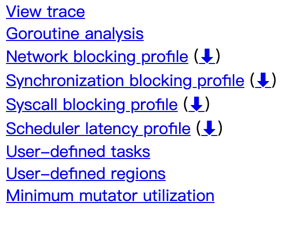
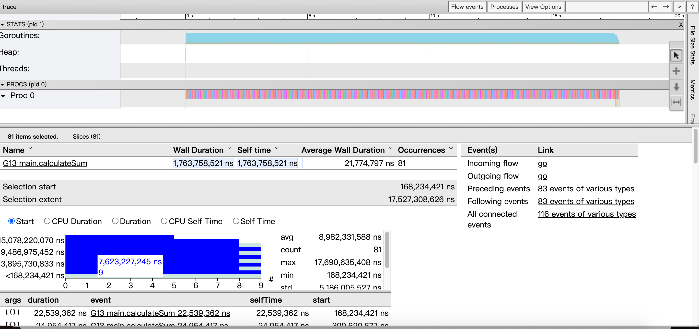

#### For-learning-Go-Tutorial
在 Golang中，Go编程标准和规范对于一个人的认知很重要.因而一开始就希望可以养成好的习惯！

#### Go异步抢占式调度

go 1.14 版本带来了一个非常重要的特性：异步抢占的调度模式。之前通过解释协程调度原理中提到,协程是用户态实现的自我调度单元，每个协程都是君子才能维护和谐的调度秩序，如果出现了流氓（占着 cpu 不放的协程）那就是是无可奈何的。

go1.14 之前的版本所谓的抢占调度是怎么样的呢下面我们一起看下?

1. 如果 `sysmon` 监控线程发现有个协程 A 执行之间太长了（或者 gc 场景，或者 stw 场景），那么会友好的在这个 A 协程的某个字段设置一个抢占标记.
2. 协程 A 在 call 一个函数的时候，会复用到扩容栈（morestack）的部分逻辑，检查到抢占标记之后，让出 cpu，切到调度主协程里.

这样 A 就算是被抢占了。我们注意到，A 调度权被抢占有个前提：A 必须主动 call 函数，这样才能有走到 morestack 的机会(能抢占君子的调度,无法抢占流氓的调度权).

这里我们用一个 P（处理器），用来确保是单处理器的场景.

通过golang 的 GMP 模型：调度单元 G，线程 M，队列 P，由于 P 只有一个，所以每时每刻有效执行的 M 只会有一个，也就是单处理器的场景（旁白：个人理解有所不同，有些人喜欢直接把 P 理解成处理器，我这里把 P 说成队列是从实现的角度来讲的）.

通过打开 golang 调试器 `trace` 工具（可以直观的观察调度的情况）,搞一个纯计算且耗时的函数 `calculateSum`.

下面创建一个名为 `main.go` 的文件，写入以下内容：

```go
package main

import (
    "fmt"
    "os"
    "runtime"
    "runtime/trace"
    "sync"
)

func calculateSum(w *sync.WaitGroup, p int) {
	defer w.Done()
	var sum, n int64
	for ; n < 10000; n++ {
		sum += n
	}
	fmt.Println(p, sum)
}

func main() {
	runtime.GOMAXPROCS(1)

	f, _ := os.Create("trace.output")
	defer f.Close()

	_ = trace.Start(f)
	defer trace.Stop()

	var wg sync.WaitGroup
	for i := 0; i < 10; i++ {
		wg.Add(1)
		go calculateSum(&wg, i)
	}
	wg.Wait()
}

```
我们分别看下 go1.13, go.14 对于这个程序的表现区别。

trace 这个就再简单提下，trace 是 golang 内置的一种调试手段，能够 trace 一段时间程序的运行情况。能看到：

* 协程的调度运行情况；
* 跑在每个处理器 P 上协程情况；
* 协程出发的事件链；
* 编译、运行的程序：

```bash
> go build -gcflags "-N -l" ./main.go
> ./main
```
这样在本地就能生成一个 `trace.output` 文件；

分析 trace 输出：
```bash
> go tool trace -http=":8080" ./trace.output
```

这样就可以直接用浏览器来方便查看分析的结果，如下：

<p align="center">

</p>

详细解析:
```markdown
* View trace：查看跟踪（这个是今天要使用的重点），能看到一段时间内 goroutine 的调度执行情况，包括事件触发链；
* Goroutine analysis：Goroutine 分析，能看到这段时间所有 goroutine 执行的一个情况，执行堆栈，执行时间；
* Network blocking profile：网络阻塞概况（分析网络的一些消耗）
* Synchronization blocking profile：同步阻塞概况（分析同步锁的一些情况）
* Syscall blocking profile：系统调用阻塞概况（分析系统调用的消耗）
* Scheduler latency profile：调度延迟概况（函数的延迟占比）
* User defined tasks：自定义任务
* User defined regions：自定义区域
* Minimum mutator utilization：Mutator 利用率使用情况
```

所以我们要是分析抢占只需要分析`View trace`。

* 横坐标为时间线，表示采样的顺序时间；
* 纵坐标为采样的指标，分为两大块：STATS，PROCS

注意: 这些采样值都要配合时间轴来看，理解成是一些快照数据.

<p align="center">

</p>

STATS:

处于上半区，展示的有三个指标: `Goroutines`，`Heap`，`Threads`，鼠标点击彩色的图样，就能看到这一小段时间的采样情况.

*  Goroutines：展示某个时间 GCWaiting，Runnable，Running 三种状态的协程个数；
* Heap：展示某个时间的 NextGC，Allocated 的值；
* Threads：展示 InSyscall，Running 两个状态的线程数量情况；

PROCS:

显示每个处理器当时正在处理的协程，事件，和一些具体运行时信息, Proc 的个数由 GOMAXPROCS 参数控制，默认和机器核心数一致.


点击一个协程区域，就会显示这个时间段的情况，有一些指标：
```markdown
* Start：开始时间（就是时间轴上的刻度）.
* Wall Duration：持续时间（这个 goroutine 在这个处理器上连续执行的小段时间）.
* Start Stack Trace：协程调用栈（切进来执行的 goroutine 调用栈）.
* End Stack Trace：切走时候时候的调用栈.
* Incoming flow：触发切入的事件.
* Outgoing flow：触发切走的事件.
* Preceding events：这个协程相关的之前所有的事件.
* Follwing events：这个协程相关的之后所有的事件.
* All connected：这个协程相关的所有事件.
```

<p align="center">

</p>


从trace图中我们可以看出:

只有一个处理器（Proc 0）调度协程；因为我们代码里面设置 GOMAXPROCS = 1, 程序运行的总时间还是 16s（虽然 10 个 goroutine 是并发运行的，但是你只有一个处理器，所以时间肯定是一样的，但如果你有多个处理器的时候，就不一样了）；这个 goroutine 只执行了 20ms 就让出处理器了；
我们大概知道，main.go 里面 `calculateSum`函数在我的机器上大概需要 1.6s 的时间，所以执行 20ms 就切走了肯定是还没有执行完的，是被强制抢占了处理器；

因此可以从`go1.14` 看出抢占式任务调度，让 goroutine 任务的调度执行更加公平，避免了流氓协程降低整个系统吞吐能力的情况发生；通过 trace 工具图形化展示了go1.14 的调度执行情况，从 trace 结果来看，非常直观.

我们理解了抢占调度带来的好处，并且形象的观测到了，并且还发现了 runtime.asyncPreempt 这个函数（是通过异步信号来实现的）；

#### License
This is free software distributed under the terms of the MIT license
